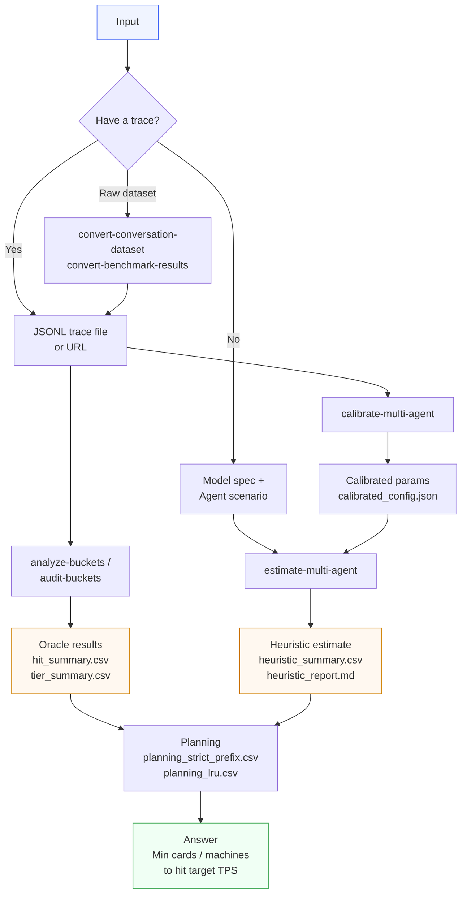

# KVCache Upper Bound Oracle

> A Chinese version of this document is available at [`README.zh.md`](./README.zh.md).

An offline analysis tool that answers one question: **"Given my deployment, how much can KV cache actually help?"**

Feed it either a real traffic trace (JSONL) or just a model spec plus an Agent-scenario description, and it tells you:

- **How much of this traffic is worth reusing** — the ceiling of the hit rate.
- **How much you can actually capture** under your current GPU memory budget — and whether the gap is caused by capacity or by the cache policy (e.g. LRU).
- **The minimum number of cards / machines** required to hit a target TPS, after the hit rate is converted into throughput.
- A **cold-start estimate** when no trace exists yet — useful for early capacity planning when all you have is "a few Agents share one system prompt."

It is not a serving runtime. It does not participate in online scheduling. Pure offline number-crunching.

## When to use it

- **Capacity sizing before a new product launches**: no real traffic yet, but you know the rough number of Agents, the shared prompt length, and the average number of conversation turns; you want to estimate "is 1 machine × 8 H20 cards enough?"
- **Planning with existing traffic**: you have a JSONL trace and want to see how throughput changes if you bump GPU memory, add a host KV tier, or switch deployment shape.
- **Comparing the cost of policy choices**: how big is the gap between "theoretical optimum" and "actually running LRU"? Is it worth the engineering effort to optimize the policy?
- **Calibrating heuristic parameters**: you have a small trace, but ultimately want a generic formula to extrapolate to other scenarios. The tool can use that small trace to back-calibrate the key heuristic parameters (Zipf shape and LRU efficiency coefficient) so they better match reality.

## What it computes

Whether you run in trace mode or heuristic mode, all results revolve around the same set of metrics. Once you understand them, every output file makes sense:

- **Content upper bound**: assuming infinite capacity, the maximum reuse this traffic allows. The first gate for "is this workload even worth caching?".
- **Relaxed upper bound (capacity oracle)**: under fixed GPU memory, the hit rate achievable by an "oracle scheduler" with full offline knowledge. This is the best you can possibly get after capacity bites.
- **Exact strict-prefix optimum**: on top of the relaxed bound, add the constraint "hits must follow strict prefix semantics." This is the truly achievable optimum. **All TPS and machine-count planning is based on this number.**
- **LRU baseline**: under the same capacity, what plain online LRU achieves. A simple, deployable lower bound on what real systems will produce.
- **TPS / machine-count planning**: multiply the hit rate by `alpha` (the coefficient that converts hit savings into throughput gain), combine with "per-card baseline TPS without any hits" and "target total TPS," and back-solve the minimum number of cards / machines required.

The four hit-rate metrics always satisfy:

```text
LRU baseline  ≤  exact strict-prefix  ≤  relaxed upper bound  ≤  content upper bound
```

When reading the results, fix your eyes on two gaps:

- **content upper bound − exact strict-prefix**: a large gap → bottlenecked by capacity → adding memory helps.
- **exact strict-prefix − LRU baseline**: a large gap → bottlenecked by policy → switching to a smarter cache policy helps.

## Workflow



## Getting started

Install first:

```bash
python3 -m pip install -e .
```

There are 4 subcommands. **If you are new, start with `estimate-multi-agent`** — it requires no trace data and is the easiest to run.

### 1. No trace — start with a cold-start estimate

Write a short Agent-scenario description (shared prompt length, number of concurrent Agents, new tokens per turn, etc.) and you get a hit-rate and machine-count estimate.

```bash
kvcache-upper-bound estimate-multi-agent \
  --config configs/public_multi_agent_qwen3_5_27b.json \
  --output-dir outputs/heuristic_qwen_1x8
```

Best for: no real traffic yet, but you need a number for a PRD or capacity review.

### 2. With a trace — precise analysis

Given a JSONL trace, the tool buckets requests by **prompt token count** (each bucket defined in the config via `lower_tokens` / `upper_tokens`, e.g. `0–32K`, `32K–64K`, `64K–128K`, ...). Every bucket independently produces the content upper bound, relaxed upper bound, exact strict-prefix optimum, LRU baseline, and the corresponding TPS / machine-count plan.

```bash
kvcache-upper-bound analyze-buckets \
  --trace https://media.githubusercontent.com/media/alibaba-edu/qwen-bailian-usagetraces-anon/main/qwen_traceA_blksz_16.jsonl \
  --config configs/public_trace_qwen3_5_27b.json \
  --output-dir outputs/run_traceA \
  --max-records 5000
```

Use `--max-records` (e.g. 5000) during debugging to validate the config, then drop it to run the full trace.

Best for: you already have a real trace and need to do capacity planning or compare deployment shapes.

### 3. Verify the results are trustworthy

`audit-buckets` does everything `analyze-buckets` does **plus** an extra correctness audit: it samples a small subset, recomputes it with a naive reference implementation, and cross-checks that the several strict-prefix solvers agree. The conclusion ("which results are formally proved, which are only supporting evidence") is written to `correctness_report.zh.md` / `.en.md`.

```bash
kvcache-upper-bound audit-buckets \
  --trace https://media.githubusercontent.com/media/alibaba-edu/qwen-bailian-usagetraces-anon/main/qwen_traceA_blksz_16.jsonl \
  --config configs/public_trace_qwen3_5_27b.json \
  --output-dir outputs/run_traceA_audit
```

`--sample-request-limit` controls the audit sample size (default 256). It only affects the coverage of the cross-check; the main analysis always runs over the full trace.

Best for: first time touching the project, or after modifying an oracle implementation, to confirm nothing has drifted.

### 4. Calibrate heuristic parameters with a trace

If your goal is "use one generic formula to extrapolate across many scenarios" but you suspect the default heuristic parameters are off, take a small trace and back-calibrate the two key parameters: the Zipf shape `zipf_s` and the LRU efficiency coefficient `lru_like`.

```bash
kvcache-upper-bound calibrate-multi-agent \
  --trace https://media.githubusercontent.com/media/alibaba-edu/qwen-bailian-usagetraces-anon/main/qwen_traceA_blksz_16.jsonl \
  --bucket-config configs/public_trace_qwen3_5_27b.json \
  --heuristic-config configs/public_multi_agent_qwen3_5_27b.json \
  --output-dir outputs/heuristic_qwen_1x8_calibrated \
  --max-records 5000
```

This command produces two recommendations side by side:

- A calibrated heuristic config `calibrated_config.json` with the parameters fit to the observation.
- A trace-derived "structure template" `recommended_heuristic_config.json` that tells you how to set the **structural parameters** — shared-prefix length, private window size, concurrent Agent count, etc. If the calibrated hit rate still differs significantly from observation (visible in the report as a large `content_gap`), tune the structure template instead of pushing `zipf_s` / `lru_like` further.

Best for: stabilizing a heuristic configuration so it can be reused for trace-less scenarios later.

## Configuration

`configs/` ships with sample files you can copy and adapt. Pick the one closest to your scenario.

### Sample configs at a glance

| Sample | Purpose |
|--------|---------|
| `public_trace_qwen3_5_27b.json` | 1 machine × 8 H20 cards, trace analysis. Capacity is essentially unconstrained — good for studying the upper bound. |
| `public_trace_qwen3_5_27b_1x1_h20.json` | 1 machine × 1 H20 card, trace analysis. Designed to amplify single-card memory pressure and show how HBM compresses the hit rate. |
| `public_trace_qwen3_5_27b_planning_norm.json` | 1 × 8 with `baseline_per_card_tps = 1` and `planning_target_total_tps = 8`, a normalized planning demo. |
| `public_trace_qwen3_5_27b_1x1_h20_planning_norm.json` | 1 × 1 with the same normalized targets — pair it with the 1 × 8 version to compare deployment shapes head-on. |
| `public_multi_agent_qwen3_5_27b.json` | 1 × 8, trace-free heuristic, based on the public Qwen3.5-27B model spec. |
| `public_multi_agent_qwen3_5_27b_1x1_h20.json` | Same as above but 1 × 1 — see how the cold-start estimate behaves when memory is tight. |

> The `baseline_per_card_tps = 1` / `planning_target_total_tps = 8` numbers in the normalized samples are illustrative only, not real production figures. Replace them with your own baseline and target TPS.

### Key fields

**Model profile (`model_profile`)** — describes the shape of the KV cache and the weight footprint:

- `n_layers` / `n_kv_heads` / `head_dim` / `dtype_bytes` / `block_size`: used to compute KV bytes per token.
- `kv_cache_layer_count`: **required for hybrid-attention models**. Counts only the layers that actually go through a token-linear KV cache; pretending all layers do will overestimate the footprint. May be omitted for uniform-attention models, in which case the tool falls back to `n_layers`.
- `tp_size` / `pp_size`: tensor / pipeline parallel sizes, used to shard per-token KV bytes per rank. Default `1`.
- `parameter_count` / `weight_dtype_bytes`: total parameter count and weight dtype size in bytes. **Only needed when you want to derive the KV budget from `gpu_memory_gb_per_card`** — the tool uses these to compute the weight shard footprint and subtract it from total GPU memory. Optional if you supply `hbm_kv_gb_per_card` directly.

**Deployment (`bucket_deployments[]` for trace mode, `deployments[]` for heuristic mode)** — describes how many cards and how much memory:

- `accelerator_count`: total card count (required).
- `cards_per_machine`: cards per machine (required). Machine count is derived as `accelerator_count / cards_per_machine`.
- `machine_spec`: a pure spec label, e.g. `"h20"`. **Only the spec name** — never write `"8*h20"` or any form that bakes a count into the spec.
- `hbm_kv_gb_per_card` / `gpu_memory_gb_per_card`: **single-card KV budget, choose one**:
  - If you know how much GB each card reserves for KV cache, fill in `hbm_kv_gb_per_card`.
  - If you only know the total GPU memory, fill in `gpu_memory_gb_per_card`; the tool subtracts the weight shard and the runtime reserve to derive the KV budget.
- `runtime_reserve_gb_per_card`: per-card runtime reserve (optional).

> All memory budget fields are **per-card**, with names ending in `_per_card`. Do not use any `*_per_machine` naming.

**TPS and planning anchors** — required to obtain "minimum cards / minimum machines":

- `total_tps` + `total_tps_unit`: raw throughput input. `total_tps_unit` is one of `cluster_total` / `per_machine` / `per_card`; the tool normalizes everything to the cluster-total value.
- `baseline_per_card_tps`: per-card TPS **with zero cache hits**. The starting point for planning; required if you want "minimum cards / minimum machines."
- `planning_target_total_tps`: the target total TPS for the cluster.
- `extra_capacity_tiers`: optional array describing extra host / SSD KV tiers per machine. Each entry has two fields: `label` (display name in the report, e.g. `"HBM+1T per machine"`) and `kv_gb_per_machine` (extra GB **per machine**, e.g. `1024` for 1 TiB).

**Global parameters**:

- `prefill_savings_alpha`: how much of the prefill cost saved by a cache hit translates into throughput gain. Default `0.8`.
- `include_output_kvcache`: when prefill and decode are not separated (PD-not-disaggregated), whether to count output-stage KV cache toward occupancy and hit rate. Default `true`.

### Heuristic-only fields

For trace-free mode you also fill in a **scenario description** under `heuristic_multi_agent` — these are the core inputs of the cold-start estimate:

- `concurrent_agents`: number of concurrent Agents.
- `shared_prefix_tokens`: length (in tokens) of the prefix shared by all Agents (e.g. system prompt + tool descriptions).
- `avg_new_tokens_per_turn`: average new tokens added per conversation turn.
- `avg_turns_per_session`: average number of turns per session.
- `private_window_tokens`: per-Agent private context window size.
- `curve_mode`: shape of the hit-rate-vs-capacity curve. One of `linear` / `power_law_fit` / `zipf_harmonic`. Default `power_law_fit`.
- `zipf_s`: Zipf shape parameter, used by both `power_law_fit` and `zipf_harmonic`.
- `policy_efficiency.lru_like`: efficiency coefficient (≤ 1.0) approximating the loss of an online policy relative to the theoretical optimum.

> These five scenario fields are exactly what `recommended_heuristic_config.json` aims to refill — after `calibrate-multi-agent`, copy the recommended values back into your `heuristic_multi_agent` block.

## Reading the output

Every run drops a set of files under `--output-dir`. You don't need to open all of them at first — find the table that answers your question and stop there.

### Hit rate first → look at these

- **`hit_summary.csv`**: the core hit-rate table. One row per length bucket, listing the content upper bound, relaxed upper bound, exact strict-prefix optimum, and LRU baseline at the current HBM budget, **plus** a column `HBM Current Bottleneck` whose value is `Capacity`, `Policy`, or `None` — telling you directly whether to add memory or change the policy. **90% of the time this is the only file you need.**
- **`tier_summary.csv`**: capacity-tier comparison. Want to know "how much extra hit rate do I get by adding 1 TiB host KV, or 10 TiB SSD?" Look here. It expands HBM, HBM+1T, HBM+10T, ... into a long table. Each row gives the strict-prefix and LRU hit rates, the columns `Strict-Prefix Gain vs Previous Tier` / `LRU Gain vs Previous Tier`, and a `Current Bottleneck` column with the same values as above.

### Machine count / TPS planning → look at these

- **`planning_strict_prefix.csv`**: planning based on the **exact strict-prefix** hit rate. Represents the theoretical upper bound — the minimum cards / machines required to hit the target TPS **under the most ideal policy**.
- **`planning_lru.csv`**: planning based on the **LRU baseline** hit rate. Represents reality — the minimum cards / machines if you actually run LRU. Comparing the two tells you "is policy optimization worth the engineering cost?"
- The two planning files use the same conversion pipeline: hit rate → TPS gain → cluster TPS capacity → minimum cards / machines. They differ only in which hit rate is used.
- The "minimum cards / minimum machines" columns require both `baseline_per_card_tps` and `planning_target_total_tps` in the config; otherwise only the basic TPS-gain columns are emitted.

### What is `summary.csv`?

It joins the hit-rate columns from `hit_summary.csv` with the planning columns from `planning_strict_prefix.csv`, giving a quick one-table view of "current HBM hit rate + minimum machines needed." Use it for a quick glance; for serious comparison, prefer the three split tables above.

### Trace-free (heuristic) only

- **`heuristic_summary.csv`** / **`heuristic_tier_summary.csv`**: same shape as `hit_summary.csv` / `tier_summary.csv`, but the numbers come from heuristic estimation instead of trace analysis.
- **`heuristic_report.zh.md`** / **`heuristic_report.en.md`**: bilingual explanatory reports describing the assumptions, formulas, parameters, and uncertainty bounds of this estimate. **If you are unsure how much to trust the heuristic numbers, read this first.**

### Calibration only

- **`calibration.json`**: calibration summary, including the trace-derived target values, the best `zipf_s` / `lru_like` found by grid search, and per-tier errors.
- **`calibration_trials.csv`**: every grid-search trial. Useful for visualizing the parameter landscape and locating the minimum-error point.
- **`calibrated_config.json`**: heuristic config with the best parameters filled in. Drop it straight into `estimate-multi-agent`.
- **`recommended_heuristic_config.json`**: a "scenario description template" reverse-engineered from the trace structure. If the calibrated hit rate still differs heavily from observation, no amount of `zipf_s` / `lru_like` tweaking will save you — the structural parameters (shared-prefix length, private window, concurrent Agents, ...) are off. Apply this template to your `heuristic_multi_agent` block and rerun.

### Metadata / correctness

- **`metadata.json`**: this run's "receipt." Records which config was used, how many records were loaded, and the normalized deployment shape. Convenient when reviewing later: "what assumptions did this run actually use?"
- **`details.json`**: per-bucket intermediate details. Use it to look up specific numbers (e.g. the equivalent card count for a given bucket).
- **`correctness_report.zh.md`** / **`correctness_report.en.md`**: emitted only by `audit-buckets`. Lists, per result, the proof path and the upper / lower bounds — i.e. what is formally proved versus what is supporting evidence.

## Further reading

When you need more depth:

- **`docs/four_layer_model.md`**: the public-facing "Capacity → Hit rate → TPS → Machine count" four-layer framework. **Recommended as the first deeper read** if this is your first encounter with the tool.
- **`docs/design_guide.md`**: implementation invariants, algorithmic choices, and milestone planning. Read before changing code or extending features.
- **`docs/correctness_guide.md`**: precise definitions of every result, the proof scope, and how to read the result tables. Read when you have doubts about the numbers.
