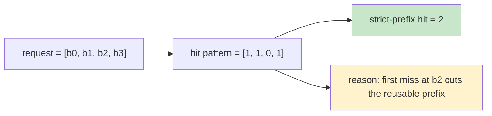
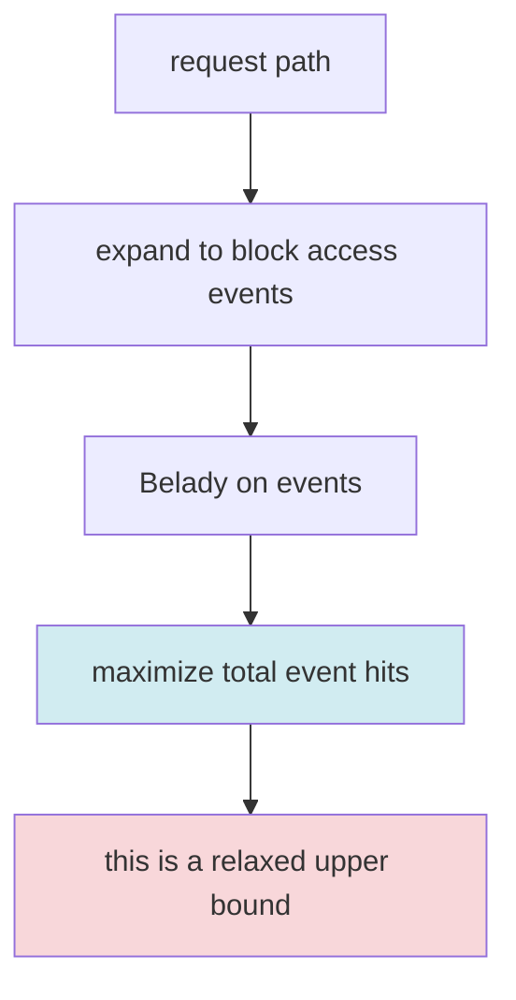

# 结果正确性说明

这份文档只回答一件事：这个项目当前到底证明了什么，没有证明什么。

> **“`strict-prefix` 说的是‘前缀必须从第一个 block 连续命中’；`relaxed upper bound` 说的是‘允许离线最优调度、允许 miss 后不准入，只看最多能保住多少 event hit’。”**
> 这两个概念定义上不同，但在项目当前穷举验证空间里，它们已经被证明收敛到同一个最优值。

## 先记住一句话

- `content upper bound`：如果完全不缺空间，只问“内容本身能复用多少”，这是精确值。
- `strict-prefix`：只有从请求第 1 个 block 开始连续命中的那一段，才算真正可复用前缀。
- `relaxed upper bound`：先放松上面的“必须连续”条件，只看 block 访问序列里理论最多能命中多少次。

如果你只想先抓住主线，可以把它理解成：

1. `content upper bound` 回答“内容上最多能复用多少”。
2. `strict-prefix capacity` 应该回答“有空间限制时，真正还能保住多少前缀复用”。
3. 当前项目已经实现了真正的 `strict-prefix capacity oracle`；`HBM Relaxed Upper Bound 命中率` 仍然保留，但它更多是解释“event-level 空间最优调度”。

## 术语速查

| 术语 | 一句话解释 | 现在项目里的地位 |
|------|------------|------------------|
| `block` | 16 tokens 一组的最小缓存分析单位 | 主分析粒度 |
| `prefix path` | 从请求第 1 个 block 开始的整段前缀路径 | 真正可复用的对象 |
| `content upper bound` | 忽略空间限制，只问历史里有没有相同前缀路径 | 已精确实现 |
| `strict-prefix hit` | 一个请求从开头开始连续命中的 block 数 | 核心容量指标 |
| `relaxed event hit` | 不要求连续，只要这个 block event 命中 resident cache 就计数 | 当前 capacity 的优化目标 |
| `relaxed upper bound` | 允许离线最优调度、允许 `no-admit` 时的 event-level 最优值 | 已实现；在当前穷举验证空间与 exact strict-prefix 一致 |

## 报表字段到底怎么读

很多人不是卡在算法，而是卡在“表里这一列和下一列到底差在哪”。下面按输出字段再解释一遍。

### 一组最重要的命中列

| 报表列 | 数学对象 | 该列回答的问题 | 什么时候最该看它 |
|--------|----------|----------------|------------------|
| `极限命中率` | `content upper bound` | 如果完全不缺空间，内容本身最多能复用多少？ | 判断 workload 是否值得做 KV cache |
| `HBM Relaxed Upper Bound 命中率` | `relaxed capacity upper bound` | 给定 HBM 容量，离线最优 event 调度最多能保住多少命中？ | 判断空间约束压掉了多少内容天花板 |
| `HBM Strict-Prefix Replay 命中率` | `strict-prefix replay` | relaxed 最优调度按 strict-prefix 重算后，还剩多少真正可复用前缀？ | 判断 relaxed 指标能否被 strict-prefix 语义兑现 |
| `HBM Strict-Prefix 命中率` | `exact strict-prefix oracle` | 在 strict-prefix 语义下，给定容量后真正的最优值是多少？ | 所有后续 TPS / 缩扩容分析都应该看它 |
| `HBM Strict-Prefix 求解路径` | `certificate` / `search` | 这个 exact 值是被证书直接夹出来，还是靠精确搜索求出来？ | 判断结果的可解释路径 |

### 一组最重要的规划列

| 报表列 | 含义 | 该列不是啥 |
|--------|------|-------------|
| `Prefill 节省系数 alpha` | 命中收益兑现成吞吐收益的比例假设 | 不是 trace 统计量，不是模型固有参数 |
| `HBM TPS Gain` | exact strict-prefix 命中率折算后的吞吐放大倍数 | 不是直接观测值，而是后处理推导值 |
| `HBM 同负载估算卡数` | 在同样总负载下，理论上需要多少卡 | 不是调度器会自动执行的缩容决策 |
| `HBM 同负载估算机器数` | 在同样总负载下，理论上需要多少机器 | 本质上由估算卡数再除单机卡数得到 |
| `HBM 估算总 TPS` | 如果不缩容，理论上最多能吃下多少总 TPS | 不是线上真实实测 TPS |
| `TPS 输入口径` | `total_tps` 是按集群总量、单机还是单卡填写的 | 不是新的性能指标，只是解释输入语义 |

### 一个最短例子

假设：

- `HBM Strict-Prefix 命中率 = 60%`
- `Prefill 节省系数 alpha = 0.8`

那么：

```text
TPS Gain = 1 / (1 - alpha * h)
         = 1 / (1 - 0.8 * 0.6)
         = 1 / 0.52
         = 1.92
```

这表示：

- 如果总负载不变，理论上所需卡数约缩到原来的 `1 / 1.92 = 52%`
- 如果卡数不变，理论上总 TPS 可以放大到原来的 `1.92x`

所以 `alpha` 的本质不是“命中率的一部分”，而是：

> **“命中了多少前缀”如何翻译成“吞吐到底能涨多少”的兑现系数。**

## strict-prefix 到底是什么意思

严格前缀的关键不是“这个 block 以前出现过”，而是：

**这个 block 前面的所有 block 也都必须命中。**

只有这样，这个请求在 prefill 阶段才真的可以复用前缀 KV。

### 直观图



上面这个例子里：

- 第 4 个 block 虽然“命中”了
- 但它前面的第 3 个 block 已经 miss
- 所以真正可复用前缀只能停在第 2 个 block

也就是说：

- `strict-prefix hit = 2`
- 不是 `3`

## relaxed upper bound 到底放松了什么

`relaxed upper bound` 放松掉的约束是：

- **不再要求命中必须从请求开头连续成立**

它把整个请求序列展开成一个 block access event 序列，然后用离线 Belady 去求：

- 在固定 resident capacity 下，最多能命中多少个 event

### 直观图



它是一个好上界，因为：

- 真实系统能做到的，不可能超过这个 relaxed 结果

但它不是 strict-prefix 最优值，因为：

- event hit 可以是离散的
- strict-prefix hit 必须是连续的

## 三层结论

- `content upper bound`：对当前定义是精确值。
- `strict-prefix capacity oracle`：已经实现；优先走 `content` / `relaxed==replay` 证书快路，证书不够时再做请求边界 DP 精确搜索。
- `system upper bound`：尚未实现。

换句话说，项目现在最硬的结论是：

1. 给定 `strict_prefix_window`、`scope` 和模型配置，trace 里到底有多少前缀内容理论上可复用，这个数是精确的。
2. 给定 HBM/扩展空间预算，项目现在已经可以给出 strict-prefix 语义下的真正最优值。
3. `HBM Relaxed Upper Bound 命中率` 与 `HBM Strict-Prefix Replay 命中率` 仍然保留，用来解释 exact 值是怎样被夹出来的。

## 三个概念的关系

把它们排成一条链最容易理解：

```text
content upper bound >= relaxed capacity upper bound >= exact strict-prefix hit rate
```

更准确地说：

- `content upper bound` 忽略空间，因此一定最大
- `relaxed capacity upper bound` 考虑空间，但目标仍是 event-level hit
- `exact strict-prefix hit rate` 才是最终想知道的容量约束结果

当前项目已经把三者都落地了：

- `content upper bound`：前缀内容天花板
- `capacity upper bound`：允许 `no-admit` 的 event-level 最优值
- `strict-prefix capacity oracle`：真正的严格前缀容量最优值

## 为什么还要同时保留 relaxed / replay / exact 三列

如果已经有真正的 exact strict-prefix oracle，一个自然的问题就是：

> “那还保留 relaxed 和 replay 干什么？”

答案是：**它们现在主要负责解释 exact 值是怎么来的。**

可以把三者看成一条夹逼链：

```text
strict-prefix replay <= exact strict-prefix <= relaxed upper bound <= content upper bound
```

于是：

- `content` 告诉你天花板在哪
- `relaxed` 告诉你 event-level 空间最优上界在哪
- `replay` 告诉你一个可实现调度在 strict-prefix 语义下能达到哪
- `exact` 告诉你真正答案

当：

- `replay == content`，或者
- `relaxed == replay`

时，exact 值可以直接被夹出来，不必再搜。

所以现在保留 relaxed / replay 不是因为“没有 exact”，而是因为：

1. 它们能证明 exact 结果为何可信。
2. 它们能解释瓶颈究竟来自内容、空间还是 strict-prefix 连续性。
3. 它们能帮助定位为什么某个桶扩容后提升不大。

## 规划公式到底在说什么

命中率结果本身回答的是“省掉了多少前缀重算”，但资源规划还需要回答：

- 这能不能真的换成更高 TPS？
- 或者同样负载下能不能少用卡？

项目当前用下面这组后处理公式：

```text
TPS Gain = 1 / (1 - alpha * h)
Estimated Total TPS = Input Total TPS * TPS Gain
Estimated Card Count For Same Load = Current Card Count / TPS Gain
Estimated Machine Count For Same Load = Estimated Card Count / Cards Per Machine
```

其中：

- `h` 是 exact strict-prefix 命中率
- `alpha` 是 prefill 节省兑现系数
- `Input Total TPS` 会先根据 `TPS 输入口径` 归一到集群总 TPS

这组公式的哲学要点是：

- 命中率是 oracle 结果
- `alpha` 是工程兑现假设
- `TPS / 卡数 / 机器数` 是派生规划结果

三者不要混为一谈。

## 为什么 content 是精确的

`content upper bound` 的定义是：

- 请求按 `(timestamp_ms, source_index)` 稳定排序。
- 每个 scope 各自维护一棵前缀树。
- 当前请求的命中块数，等于历史请求中已出现过的最长前缀路径长度。

实现入口在：

- `src/kvcache_upper_bound/oracle/content.py`
- `src/kvcache_upper_bound/oracle/prefix_trie.py`

它是精确的原因有两个：

1. 可复用对象被定义为“前缀路径节点”，不是裸 block hash。
2. 前缀树匹配和朴素 reference 实现可以逐请求对齐。

项目内置了两个证明层级：

- 单元测试：覆盖重复前缀、不同父前缀下同 block、session/global scope。
- 穷举 reference 校验：对小规模 toy trace，把快速 trie 实现和朴素 `O(N^2 * L)` 实现逐例对比。

默认 audit 会输出：

- `content cases verified = 41370`

这表示在 `max_requests=4`、`max_blocks_per_request=3`、字母表 `{"a","b"}` 的小规模空间里，快速实现与 reference 完全一致。

## 为什么 HBM 空间结果还要保留 relaxed

当前 `capacity.py` 的 resident set 优化目标是：

- 把每个前缀节点访问看成一个 block access event
- 在固定 block capacity 下，用离线 Belady 最大化 event hit 数

这件事本身是对的；项目也会做穷举校验：

- `relaxed capacity cases verified = 165338`

这表示 Belady 实现与同一目标下的暴力 reference 完全一致。

问题在于，这个目标和最终关心的指标不是同一个“说法”。

最终关心的是：

- 一个请求从第 1 个 block 开始，能连续复用多少前缀 block

而 relaxed Belady 优化的是：

- 整个访问序列里，总共有多少个 block event 命中

项目现在的关键发现是：

- 在允许 `no-admit` 的语义下，当前穷举验证空间里 `relaxed hits == strict-prefix replay == exact strict-prefix`
- 所以 relaxed 指标仍然保留，但它不再只是“可能松的上界”；它在已验证空间已经与 exact strict-prefix 收敛

## exact proof path：什么时候不用搜索也能拿到 strict-prefix 精确值

项目当前有两条 exact certificate：

```text
strict-prefix replay == content upper bound
```

以及：

```text
relaxed upper bound == strict-prefix replay
```

第一条证书表示：

1. `content upper bound` 是 strict-prefix 语义下的精确上界
2. `strict-prefix replay` 是一个实际可实现调度得到的命中结果，因此它是可实现下界
3. 两端相等时，strict-prefix 最优值被直接夹出来

第二条证书表示：

1. `relaxed upper bound` 是 exact strict-prefix 的合法上界
2. `strict-prefix replay` 是 exact strict-prefix 的合法下界
3. 如果二者相等，就不必再搜索，exact strict-prefix 就是这个值

于是可以立即推出：

```text
strict-prefix replay <= strict-prefix optimal <= relaxed upper bound <= content upper bound
```

现在报表里会同时给出：

- `HBM Strict-Prefix 命中率`：exact strict-prefix oracle 的精确值
- `HBM Strict-Prefix 求解路径`：`certificate` 或 `search`

也就是说，用户不再需要从一个布尔字段猜“是不是精确”，而是直接看到精确值和它是怎么得到的。

## 真实 trace 怎么做侧证

项目当前提供三类侧证：

1. `sample fast == naive`
   - 对每个 bucket 的前 `N` 个请求，快速 content 实现与朴素 reference 逐请求对比。
2. `unique_prefix_nodes / resident_block_capacity / max_request_blocks`
   - 展示输入工作集大小与空间预算的相对尺度。
3. `content_hit_blocks / relaxed_hbm_hit_blocks`
   - 展示空间约束有没有压低内容天花板。
4. `relaxed_hbm_hit_blocks / strict_prefix_replay_hbm_hit_blocks`
   - 展示 relaxed 证书与 strict-prefix 证书是否已经收敛。
5. `strict_prefix_hit_blocks / strict_prefix_proof_source`
   - 直接展示 exact strict-prefix oracle 的结果，以及它是证书快路还是精确搜索。
6. `strict_prefix_certified_lower_bound_hit_blocks / strict_prefix_certified_upper_bound_hit_blocks`
   - 展示 oracle 在进入搜索前后，到底把 strict-prefix 最优值夹在了什么区间里。

这些信息会写入：

- `correctness_report.json`
- `correctness_report.md`

其中：

- `correctness_report.zh.md` 是中文报告
- `correctness_report.en.md` 是英文报告

需要特别注意：

- `strict-prefix replay HBM hits` 仍然是一个可实现诊断值
- 但项目现在已经有独立的 `strict-prefix capacity oracle`
- 当 `replay == content` 或 `relaxed == replay` 时，oracle 会直接走证书快路，不必进入搜索
- 当两类证书都不够时，oracle 会进入请求边界 DP 精确搜索；这时 `proof source = search`

## 当前最诚实的口径

如果你要对外解释当前项目，请用下面这段话：

> 这个分析器已经精确实现了窗口感知的 content upper bound，也已经实现了真正的 strict-prefix capacity oracle；同时它会继续保留 relaxed / replay 指标，作为 exact 结果的可解释证书。

## 下一步

现在真正剩下的工作，不再是“有没有 strict-prefix oracle”，而是：

- 怎样把 exact strict-prefix oracle 更快地扩展到更大的 trace
- 怎样把 exact / certificate / search 三种路径更清楚地展示到结果报表里
- 怎样把 `system upper bound` 的带宽与 deadline 约束接上来
