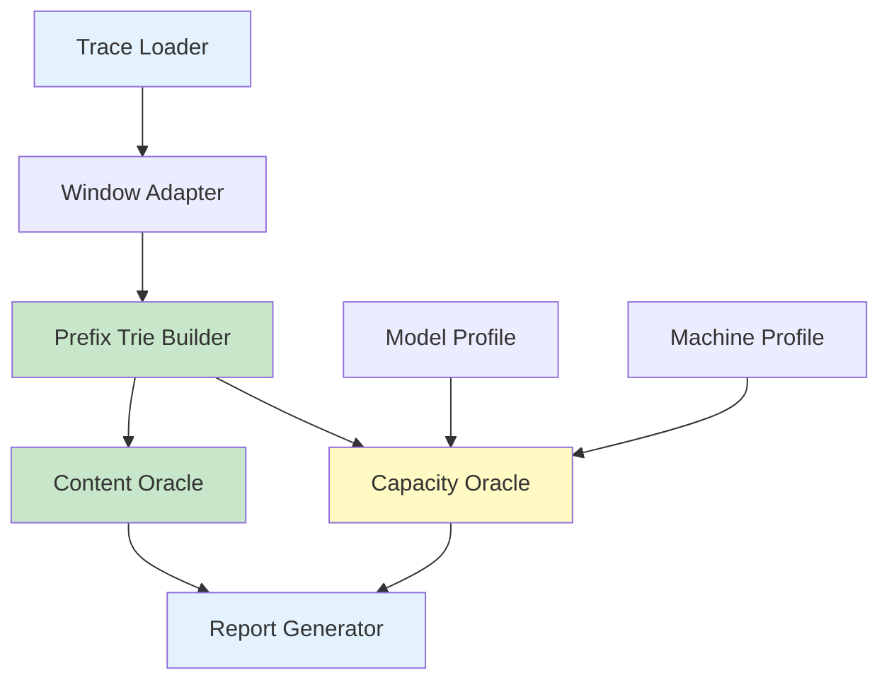
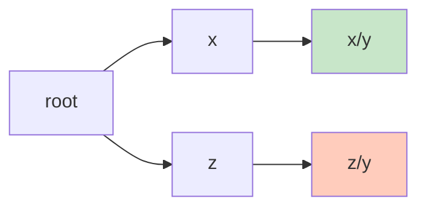
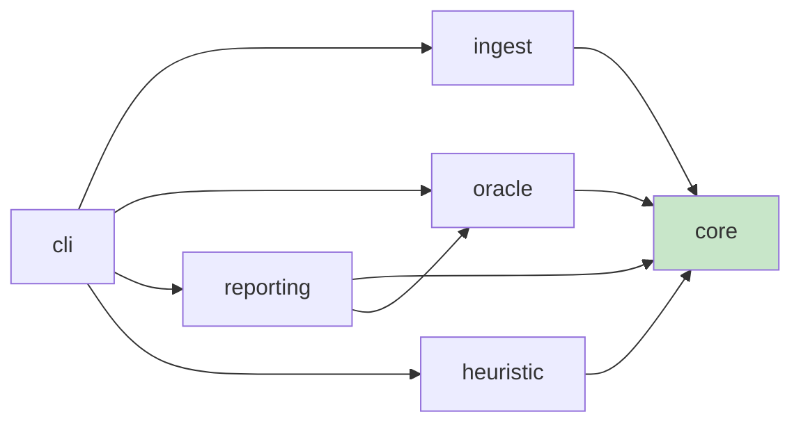

# Window-Aware KVCache Upper-Bound Analyzer: Design Guide

> **"First make the ceiling of reusable content precise, then discuss how to build the cache system; otherwise you are only precisely simulating an ill-defined problem."**
> This document is an implementation guide, not a marketing introduction. Future code, tests, CLI behavior, and experiment outputs must follow the definitions and phase boundaries defined here.

---

## Background: What This Project Actually Solves

This project targets the public `qwen-bailian-usagetraces-anon` trace. The trace preserves request timestamps, session-tree relations, input/output lengths, and `hash_ids` after chunking by 16 tokens. This is sufficient to answer one key question:

**Given a window size, model structure, and machine resources, how much KVCache can a workload theoretically reuse at most?**

For external presentation, the main line can be simplified to `Capacity -> Hit Rate -> TPS -> Machine Demand`; see `docs/four_layer_model.en.md`. Internally, the implementation keeps finer-grained layering and correctness constraints.

This document focuses on the internal implementation definition. Internally, the framework is fixed into four layers:

| Layer | Question Answered | Inputs |
|-------|-------------------|--------|
| **Content Upper Bound** | How much prefix content in the requests is reusable? | trace |
| **Capacity Upper Bound** | Under limited GPU/CPU KV budget, how much reuse can still be preserved? | trace + model + KV budget |
| **Policy Baseline** | If using a simple online policy such as LRU, how far is it from the upper bound? | trace + model + KV budget |
| **Cold-Start Estimate** | Without a trace, how can we first estimate `Capacity -> Hit Rate -> TPS`? | model + deployment + heuristic assumptions |

**Decisions:**

- `content / exact strict-prefix / LRU baseline` are trace-driven results.
- `TPS / machine count` remains report-layer post-processing and must not be disguised as a system-level oracle.
- `multi-agent heuristic` is the fourth-layer cold-start estimator. It is only used when no trace is available, must be explicitly marked as heuristic, and must not be mixed with oracle results.

---

## Goals and Non-Goals

### Goals

- Accept Bailian trace, model information, machine information, and window-size lists as input.
- Output main-layer `content / relaxed / exact strict-prefix / LRU` results under different windows.
- Output reusable KV bytes, working-set size, and budget-sensitivity curves.
- Support sliced analysis by `type / turn / input bucket / session scope`.
- Without a trace, support multi-agent cold-start estimation based on `shared prefix + private working set + curve shape`.

### Non-Goals

- Do not recover the original prompt text.
- Do not simulate decode kernels or a full serving runtime in the first version.
- Do not use HiSim as the first implementation entry point.
- Do not mix all policy problems into upper-bound computation prematurely.

---

## Correctness Strategy

The project splits "proving correctness" into three kinds of work:

1. **Definition proof**
   - Freeze window, scope, hit-rate, and model formulas first, avoiding silent definition drift during implementation.
2. **Reference cross-checking**
   - Cross-check `content upper bound` against a naive reference case by case.
   - Cross-check the current `capacity upper bound` against a brute-force reference for the same relaxed objective, allowing `no-admit`.
   - Cross-check the `strict-prefix capacity oracle` against a brute-force reference for the exact objective.
3. **Certificates and equivalence checks**
   - Explicitly output exact certificates such as `replay == content` and `relaxed == replay`.
   - Within the current exhaustive validation space, verify whether `relaxed == replay == exact strict-prefix` holds.

The goal is not to decorate the result, but to separate "already proven", "directly squeezed by certificates", and "still requiring search".

See `docs/correctness_guide.en.md` for details.

---

## Without-Trace Heuristic: Fourth-Layer Cold-Start Engine

The fourth layer does not try to prove "production will definitely behave this way". Instead, it provides a cold-start estimate that has clear structure, fewer parameters than full replay, and better explainability than a single empirical curve.

### Structural Assumptions

Define:

- `n`: concurrent agent count
- `S`: shared prefix token count across all agents
- `Delta`: new tokens per turn
- `T`: average session turns
- `W`: private window per agent

Under the append-only session assumption, the average reusable private prefix per agent is:

```text
P = (1 / T) * sum_{i=0}^{T-1} min(W, i * Delta)
```

The total private working set and total working set are:

```text
W_private_total = n * P
W_total = S + n * P
```

The average request length and content ceiling are:

```text
L_request = S + Delta + P
h_content = (S + P) / L_request
```

### Capacity-to-Hit Estimation

When total capacity is `C`:

1. Assume the shared prefix `S` is covered first.
2. Use the remaining capacity to cover the private working set.
3. Do not assume the private portion grows linearly by default; delegate it to a shape function `g(r)`:

```text
r = clip((C - S) / (n * P), 0, 1)
```

Then the strict-prefix upper-bound estimate is:

```text
h_strict_est(C) = min(h_content, (S + g(r) * P) / L_request)
```

The current implementation supports three `g(r)` modes:

| Mode | Formula | Purpose |
|------|---------|---------|
| `linear` | `g(r) = r` | Simplest linear approximation |
| `power_law_fit` | `g(r) = r^(1 - 1/s)` | Directly absorbs a Zipf-inspired simplified formula |
| `zipf_harmonic` | `g(r) = H_{floor(rN), s} / H_{N, s}` | Uses discrete Zipf cumulative mass as a more stable shape function |

`power_law_fit` absorbs the common external approximation:

```text
h(C) ~= (C / W_total)^(1 - 1/s)
```

This is useful, but it must be called a Zipf-inspired heuristic, not a rigorous proof.

### Online Policy Approximation

Without a trace, exact LRU replay is impossible. Therefore the fourth layer only outputs an `LRU-like` approximation:

```text
r_lru = clip(eta * (C - S) / (n * P), 0, 1)
```

Here `eta in (0, 1]` is `policy_efficiency.lru_like`, representing the effective-capacity loss caused by eviction order, local conflicts, and imperfect admission.

Then:

```text
h_lru_like_est(C) = min(h_content, (S + g(r_lru) * P) / L_request)
```

**Hard constraints:**

- `LRU-like` is only an estimate and must not be called `LRU oracle`.
- The `LRU-like` efficiency coefficient must not exceed the `strict-prefix upper bound`.
- Any heuristic result must be output separately from trace oracle results.

### Trace Calibration

The fourth layer may add one more step: use a small real trace to calibrate `zipf_s` and `lru_like`. The wording must remain fixed:

- Only calibrate shape parameters and policy-efficiency parameters.
- Do not call calibration "proof of correctness".
- If the `content ceiling` still clearly does not align, explicitly state that the issue is in the structural parameters instead of pretending `zipf_s` can solve everything.

Calibration targets come from aggregated trace-oracle results:

```text
observed content hit rate
observed strict-prefix hit curve
observed LRU hit curve
```

The current implementation performs a grid search over `zipf_s × lru_like` and outputs:

- `calibration.json`
- `calibration_trials.csv`
- `calibrated_config.json`
- `recommended_heuristic_config.json`

The `heuristic_report.zh.md / heuristic_report.en.md` report explicitly records:

- sample source
- trace structure suggestion
- best parameters
- layered errors
- `content_gap`

`content_gap` is one of the most important diagnostics:

```text
content_gap = heuristic_content_ceiling - observed_content_ceiling
```

If it is large, the `shared/private` structural assumption should be corrected first, instead of over-tuning curve parameters.

### Trace Structure Suggestion

In addition to `zipf_s / lru_like` calibration, the fourth layer supports a structure-suggester path:

- Estimate shared-prefix scale from pairwise common prefixes among root requests.
- Estimate concurrent agent count from overlapping session lifetimes.
- Infer `avg_turns_per_session / private_window_tokens` from observed private reuse.
- If trace content ceiling is available, back-solve `Delta` to align with the content ceiling.

It outputs `recommended_heuristic_config.json`. The goal is not to replace the oracle, but to first align the heuristic structural template.

---

## Frozen Definitions

### 1. Window Semantics

The first version uses `strict_prefix_window`:

- For each request, keep only the effective input corresponding to the last `W` tokens.
- After truncation, still compute hits by prefix reuse.
- Do not assume position shifting, window relocation, or RoPE-aware reuse transformation.

| Option | Meaning | Conclusion |
|--------|---------|------------|
| `strict_prefix_window` ⭐ | Prefix-path consistency is still required after truncation | ✅ Default for v1 |
| `window_shift_oracle` | Allows remapped reuse after windowing | ❌ Study in v2 |

### 2. Granularity

- Main granularity: `block`
- Default `block_size = 16`
- Token hit rate is only a conversion from block hit rate

### 3. Hit-Rate Definitions

The report must output all three metrics:

| Metric | Definition | Usage |
|--------|------------|-------|
| `block_hit_rate` | hit blocks / total effective blocks | Main metric |
| `token_hit_rate_est` | estimated hit tokens / effective input tokens | Context-length explanation |
| `kv_byte_hit_rate` | hit KV bytes / total KV bytes | Machine-resource explanation |

### 4. Prefill / Decode Boundary

By default, only **prefill reuse** is counted:

- Whether input-prefix KV can be reused counts as a hit.
- KV generated by decode tokens is not included in the main hit rate.

#### Output KV Cache Extension (`include_output_kvcache`)

In non-PD-separated deployments, where prefill and decode share the same GPU memory, output KV cache generated during decode remains on GPU, occupies cache space, and affects later hit rates. This feature can be enabled with `"include_output_kvcache": true`.

**Core mechanism:**

The trace only records input `hash_ids` for each request and does not contain output block hashes. However, in multi-turn sessions, later requests naturally include the previous turn's output content:

```text
child.hash_ids = [parent_input_blocks | parent_output_blocks | new_user_input_blocks]
```

Therefore, when a child request appears, the parent's true output block hashes can be extracted backward from the child's `hash_ids`:

```text
parent_output_hashes = child.hash_ids[parent.block_count : parent.block_count + parent_output_blocks]
```

Parent-child matching uses `parent_chat_id`. If multiple children exist, sort by `turn` and use the earliest child.

**Impact on layers:**

| Layer | Behavior |
|-------|----------|
| **Content Upper Bound** | After the parent finishes, inject the full `input + output` path into the trie; later prefix matches can cover output blocks |
| **Capacity Upper Bound** | Real output hashes share node ids with child requests after trie injection and occupy cache space for Belady/LRU eviction |
| **Policy Baseline** | Same as capacity upper bound |
| **Last Turn** | No child request exists, so output blocks are unknown; unknown-output accounting only reserves capacity and cannot produce hits |

**Effects:**

- With sufficient capacity, cached output blocks increase strict-prefix hit depth for the next turn.
- Under tight capacity, output blocks consume additional GPU memory and may reduce overall hit rate.
- Disabled by default (`false`) to preserve the original definition.

### 5. Scope

The first version always outputs two oracle scopes:

- `session_oracle`: reuse only within the same session tree
- `global_oracle`: reuse from all historical requests

---

## Core Formula: How Model Information Enters Computation

For standard Transformer / GQA, per-token KV size is computed as:

```python
from dataclasses import dataclass

@dataclass(frozen=True)
class ModelProfile:
    n_layers: int
    n_kv_heads: int
    head_dim: int
    dtype_bytes: int
    kv_cache_layer_count: int | None = None
    tp_size: int = 1
    pp_size: int = 1
    block_size: int = 16

    def kv_bytes_per_token(self) -> int:
        layers = self.n_layers if self.kv_cache_layer_count is None else self.kv_cache_layer_count
        return 2 * layers * self.n_kv_heads * self.head_dim * self.dtype_bytes

    def kv_bytes_per_block(self) -> int:
        return self.block_size * self.kv_bytes_per_token()
```

Where:

- `2` means `K + V`.
- `n_kv_heads` must be KV head count, not total attention head count.
- `kv_bytes_per_token` here means the total KV footprint of the whole TP/PP deployment, directly comparable with total HBM or expanded storage budget.
- For hybrid-attention models, `kv_cache_layer_count` must count only layers that actually produce token-linear KV; for example, `Qwen/Qwen3.5-27B` uses `16`, not `64`.
- The first version assumes constant KV bytes per block and does not model padding or alignment overhead.

---

## Architecture Overview: Three-Stage Offline Oracle



The philosophy is explicit:

- First answer "whether there is reusable content".
- Then answer "whether that content can be kept".
- Only then answer "whether it can be moved in time".

Do not mix these three questions into a black-box simulator. Black boxes are easiest to build and also easiest to hide errors in.

---

## Data Model Requirements

### RequestRecord

```python
from dataclasses import dataclass
from typing import Optional, Tuple

@dataclass(frozen=True)
class RequestRecord:
    request_id: str
    timestamp_ms: int
    chat_id: str
    parent_chat_id: Optional[str]
    turn: int
    request_type: str
    input_length: int
    output_length: int
    hash_ids: Tuple[str, ...]
```

### EffectiveRequest

- `request_id`
- `timestamp_ms`
- `scope_root_id`
- `effective_hash_ids`
- `effective_blocks`
- `effective_tokens`
- `turn`
- `request_type`

### TrieNode

- `node_id`
- `parent_id`
- `block_hash`
- `depth`
- `first_seen_ts`
- `accesses[]`
- `future_accesses[]`
- `size_bytes`

**Constraint:** `TrieNode` represents a "prefix-path node", not a raw content block. This must not regress.

---

## Why Prefix Trie Is Required

If you only count by block hash, you will mistake "same content block" for "same reusable KV entity". That is wrong.



`x/y` and `z/y` end with the same block `y`, but they do not share the same prefix state, so they cannot simply be treated as the same KV node.

**Conclusion:**

- ✅ What can be reused is an already-seen prefix path.
- ❌ It is not simply the same block content seen before.

---

## Implementation Phases

### Phase 0: Freeze Input and Output Definitions

Deliverables:

- `docs/design_guide.zh.md` and `docs/design_guide.en.md`
- Clear defaults and boundaries

Default parameters:

| Parameter | Default |
|-----------|---------|
| `block_size` | `16` |
| `window_policy` | `strict_prefix_window` |
| `scope` | `session + global` |
| `main_metric` | `block_hit_rate` |
| `count_decode` | `false` |

Exit criteria:

- Later implementation no longer changes definitions implicitly.
- CLI and tests directly reference the definitions here.

### Phase 1: Trace Normalization

Tasks:

1. Parse JSONL.
2. Generate stable `request_id`.
3. Validate the basic consistency of `input_length` and `hash_ids`.
4. Rebuild `chat_id / parent_chat_id` relations.
5. Generate `EffectiveRequest` under different windows.

Principles:

- Sort by `timestamp`; use input order as a stable tie-breaker for equal timestamps.
- `effective_blocks = ceil(window / block_size)`.
- Effective block sequence is `hash_ids[-effective_blocks:]`.
- If original input is shorter than the window, keep all blocks.

A pure intermediate layer such as `normalized_requests.parquet` is recommended so later oracles do not read raw JSONL directly.

Exit criteria:

- Given the same trace and window, the same `EffectiveRequest` set is produced deterministically.
- Abnormal samples have explicit counts and logs rather than being silently skipped.

### Phase 2: Content Oracle

Tasks:

1. Insert into the prefix trie in timestamp order.
2. For each request, find the longest prefix already present in history.
3. Output per-request hit and miss block counts.
4. Aggregate window curves and workload-slice reports.

Core algorithm:

1. Traverse the effective block sequence.
2. Match from trie root block by block.
3. Existing nodes are hits; first-seen nodes are misses.
4. After processing a request, write the full path back into the trie.

Output metrics:

- `content_block_hit_rate`
- `content_kv_byte_hit_rate`
- `reusable_kv_bytes`
- `content_hit_rate_by_type`
- `content_hit_rate_by_turn`

Exit criteria:

- `global_oracle >= session_oracle`.
- hits + misses = total effective blocks.
- Hit rate is 0 on a subset with no historical requests.

### Phase 3: Capacity Oracle

Tasks:

1. Build future access sequences for trie nodes.
2. Run offline optimal eviction under `gpu_kv_budget_bytes`.
3. Optionally add a secondary `cpu_kv_budget_bytes` layer.
4. Output budget-sensitivity analysis.

Algorithm choices:

| Option | Conclusion | Reason |
|--------|------------|--------|
| LRU | ❌ Not suitable as an upper bound | Only an online heuristic |
| LFU | ❌ Not suitable as an upper bound | Ignores time order |
| Belady ⭐ | ✅ Default in v1 | Offline optimal and suitable as an upper bound |

Simulation logic:

- A node can be admitted when it first enters the system.
- If over budget, evict the node whose next access is farthest away.
- Budget is counted as `kv_bytes_per_block * resident_blocks`.
- The first version starts with single-layer GPU; GPU+CPU is an extension.

Output metrics:

- `capacity_block_hit_rate`
- `capacity_kv_byte_hit_rate`
- `required_working_set_bytes`
- `budget_vs_hit_rate`

Exit criteria:

- `capacity_upper <= content_upper`.
- Hit rate does not decrease as budget increases.
- With sufficiently large budget, capacity upper bound approaches content upper bound.

### Phase 4: System Oracle

Tasks:

1. Build a `promotion task` for each node that needs future reuse.
2. Use timestamps and bandwidth constraints to determine whether it can be moved in time.
3. Output `gpu resident hit / promoted hit / miss`.

Suggested model:

- Task size: `kv_bytes_per_block`
- Release time: time when the current access finishes
- Deadline: next access time
- Link capacity: `bandwidth_bytes_per_sec * delta_t`

Only this phase should introduce:

- `cpu_to_gpu_bandwidth`
- optional `remote_to_cpu_bandwidth`
- optional number of concurrent transfer channels

Exit criteria:

- `system_upper <= capacity_upper`.
- With zero bandwidth, cross-tier promotion hits should be 0.
- With very large bandwidth, system upper bound approaches capacity upper bound.

---

## Recommended Module Split

| Module | Responsibility |
|--------|----------------|
| `ingest/trace_loader.py` | Read JSONL and produce raw records |
| `ingest/normalizer.py` | Generate `EffectiveRequest` |
| `core/models.py` | Data classes and shared types |
| `oracle/prefix_trie.py` | Prefix-path insertion and matching |
| `oracle/content.py` | Content upper-bound computation |
| `oracle/capacity.py` | Belady capacity upper-bound computation |
| `oracle/lru.py` | Online LRU policy baseline |
| `heuristic/multi_agent.py` | Without-trace multi-agent cold-start estimation |
| `heuristic/output.py` | Without-trace heuristic output layer |
| `reporting/buckets.py` | Deployment table aggregated by length bucket |
| `cli/main.py` | Command-line entry point |

Dependencies must remain one-way:



**Rules:**

- `oracle/` does not read files directly.
- `reporting/` does not call `cli/` backward.
- `core/` only contains stable objects and pure utilities.

---

## CLI Design Suggestions

The current CLI keeps four main commands:

```bash
kvcache-upper-bound analyze-buckets \
  --trace /path/to/trace.jsonl \
  --config configs/public_trace_qwen3_5_27b.json \
  --output-dir outputs/run_001

kvcache-upper-bound audit-buckets \
  --trace /path/to/trace.jsonl \
  --config configs/public_trace_qwen3_5_27b.json \
  --output-dir outputs/run_001_audit

kvcache-upper-bound estimate-multi-agent \
  --config configs/public_multi_agent_qwen3_5_27b.json \
  --output-dir outputs/heuristic_run_001

kvcache-upper-bound calibrate-multi-agent \
  --trace https://media.githubusercontent.com/media/alibaba-edu/qwen-bailian-usagetraces-anon/main/qwen_traceA_blksz_16.jsonl \
  --bucket-config configs/public_trace_qwen3_5_27b.json \
  --heuristic-config configs/public_multi_agent_qwen3_5_27b.json \
  --output-dir outputs/heuristic_calibrated_001 \
  --max-records 5000
```

Minimum outputs:

| File | Content |
|------|---------|
| `summary.csv` | Compatibility summary table; keeps HBM main hit results, diagnostics, and main planning columns |
| `hit_summary.csv` | Core hit-estimation table; only current-HBM `content / relaxed / lru / replay / exact strict-prefix / proof source / bottleneck diagnostics` |
| `planning_strict_prefix.csv` | Upper-bound planning table based on exact strict-prefix `TPS Gain`; also includes `Estimated Total TPS` and target-TPS min deployment columns when configured |
| `planning_lru.csv` | Policy planning table based on LRU `TPS Gain`; other rules align with `planning_strict_prefix.csv` |
| `tier_summary.csv` | Long capacity-tier table expanding tiers such as `HBM / HBM+1T / HBM+10T`; outputs `Strict-Prefix / LRU / gain / diagnostics / planning` consistently |
| `details.json` | Detailed content / relaxed / exact strict-prefix summary for each bucket |
| `metadata.json` | Input parameters, load statistics, and report-row mirrors |
| `correctness_report.{json,md,zh.md,en.md}` | Reference checks, trace sample reconciliation, and strict-prefix solve-path explanation |
| `heuristic_summary.csv` | Without-trace main table; current-HBM cold-start estimates and main planning columns only |
| `heuristic_tier_summary.csv` | Without-trace capacity-tier long table comparing tiers such as `HBM / HBM+1T / HBM+10T` |
| `heuristic_report.{md,zh.md,en.md}` | Without-trace heuristic explanation report; assumptions, parameters, formulas, and result boundaries |
| `calibration.json` | Trace calibration summary; sample source, best parameters, and layered errors |
| `calibration_trials.csv` | Trace calibration grid-search results |
| `calibrated_config.json` | Calibrated heuristic config |
| `recommended_heuristic_config.json` | Trace structure suggestion template with `shared/private` assumptions closer to the sample |

Rules:

- `Estimated Card Count For Same Load / Estimated Machine Count For Same Load` stay only in `details.json` as local compute-equivalent diagnostics.
- `Target Total TPS Min Cards / Target Total TPS Min Machines` are the absolute planning results after feeding capacity constraints back into the search.
- `Strict-Prefix Gain Over Previous Tier / LRU Gain Over Previous Tier` in `tier_summary.csv` answers whether adding this tier is worthwhile.
- `heuristic_summary.csv / heuristic_tier_summary.csv` only represent cold-start estimates and must not be read as proven oracle results.
- `calibration.json` only means "this parameter set is closer to this sample"; it does not upgrade the result into `oracle proof`.

---

## Tests and Validation

### Unit Tests

Cover these boundaries first:

- empty trace
- single-request trace
- repeated identical prefixes
- same block under different prefix paths
- window smaller than input length
- zero / sufficiently large budget

### Property Tests

Must verify:

| Property | Expected |
|----------|----------|
| `global >= session` | Always true |
| `content >= capacity >= system` | Always true |
| budget increases | hit rate does not decrease |
| no history | hit rate is 0 |

### External Validation

Optional future work:

- replay small samples with `trace-replayer`
- compare real prefix-cache hit trends with oracle curves
- validate trends only; exact numeric equality is not required

---

## Risks and Mitigations

| Risk | Impact | Mitigation |
|------|--------|------------|
| `hash_ids` are only block-level | Limited token precision | Keep block granularity as the main metric |
| inconsistent window semantics | Curves become hard to explain | Keep only one default semantic in v1 |
| treating same block as same node | Systematic overestimation | Force prefix trie usage |
| estimating KV budget directly from total GPU memory | Distorted capacity conclusions | Explicitly input `gpu_kv_budget_bytes` |
| treating heuristic as oracle | Decisions misled by false precision | Reports, column names, and docs explicitly mark estimates |
| integrating HiSim too early | Problem domain becomes confused | Build the offline oracle first |

---

## Milestones and Acceptance

| Milestone | Deliverable | Acceptance |
|-----------|-------------|------------|
| **M0** | Docs and skeleton | Definitions frozen, directory stable |
| **M1** | Trace normalization | Can generate `EffectiveRequest` |
| **M2** | Content Oracle | Can output window hit-rate curves |
| **M3** | Capacity Oracle | Can output budget-sensitivity curves |
| **M4** | System Oracle | Can output bandwidth-constrained upper bounds |
| **M5** | Experiments and comparison | Can explain window, budget, and bandwidth curves |

The current target is to complete `M1 + M2` first:

- Turn trace into a stable intermediate representation.
- Compute the content upper-bound hit-rate curve.

This is the most important foundation of the project. If the foundation is unstable, later capacity and system simulations will drift.

---

## Recommended Implementation Order

Follow this order for the lowest complexity:

1. Implement `core/models.py` first.
2. Then implement `ingest/trace_loader.py`.
3. Then implement `ingest/normalizer.py`.
4. Then build `oracle/prefix_trie.py`.
5. Finally wire `oracle/content.py` and the minimal `cli`.

Do not start with charts, concurrency, remote tiers, or HiSim integration.

---

## Current Implementation Status

As of `2026-03-17`, the project has completed:

- `M1`: trace normalization
- `M2`: content upper bound
- `M3`: Belady capacity upper bound under single-layer / expanded total capacity with `no-admit`
- `M4`: real strict-prefix capacity oracle and request-level exact search
- Bucketed reports for generic result output, directly producing columns such as `Bucket / Machine Count / Accelerator Count / Cards Per Machine / Machine Spec / Total TPS / TPS Input Unit / HBM / Content Upper Bound Hit Rate / HBM Relaxed Upper Bound / HBM Strict-Prefix Replay / HBM Strict-Prefix / Proof Source`

Out of the current offline-oracle scope:

- `system upper bound`: bandwidth and deadline constraints
- real multi-machine placement and routing policy
- performance-mapping layer for HiSim or trace-replayer

---

## Summary

| Dimension | Guidance |
|-----------|----------|
| **Problem definition** | This is an upper-bound analyzer, not a serving runtime |
| **Core data structure** | Prefix-path trie, not a block-frequency table |
| **Main implementation order** | Normalize trace -> content upper bound -> capacity upper bound -> system upper bound |
| **V1 boundary** | `strict_prefix_window` + `prefill only` + `block` granularity |
| **Most important outputs** | window curves, budget curves, working-set size |

Final takeaway:

**First compute "what can be reused" correctly, then optimize "how to keep it cached". This is the only correct starting point for this project.**

---

## References

- Bailian Trace: `https://github.com/alibaba-edu/qwen-bailian-usagetraces-anon`
- Trace Replayer: `https://github.com/blitz-serving/trace-replayer`
- Tair KVCache / HiSim: `https://github.com/alibaba/tair-kvcache`

---

**Document generated at**: 2026-03-17  
**Author**: OpenCode
