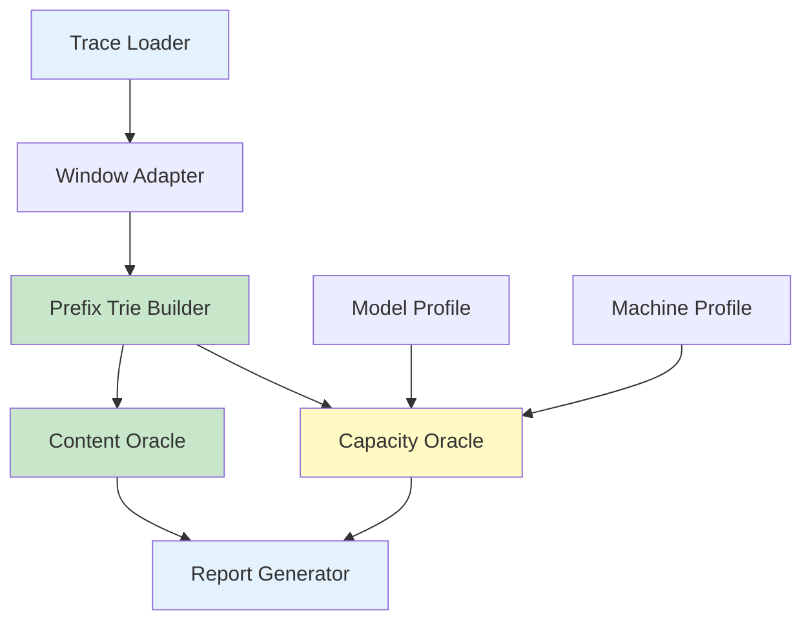
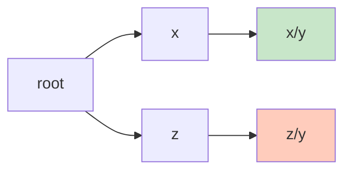
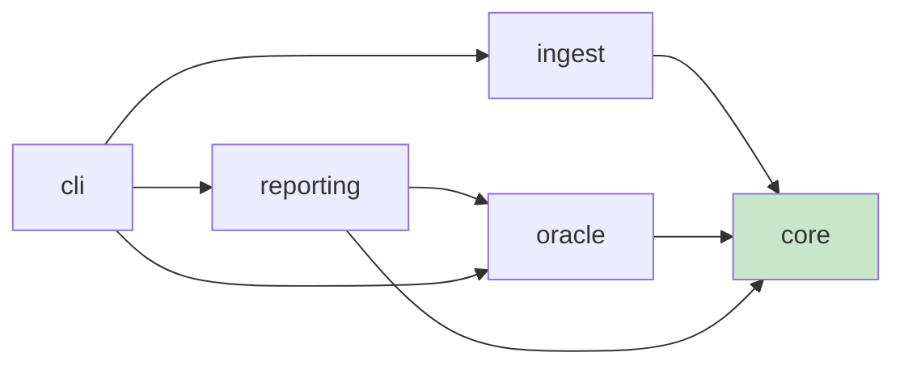

# 窗口感知 KVCache 上限分析器：设计指导文档

> **“先把可复用内容的天花板算清楚，再谈缓存系统怎么做；否则你只是在精确模拟一个定义不清的问题。”**
> 这份文档不是介绍材料，而是实现指南。后续代码、测试、CLI 和实验输出，都必须服从这里定义的口径和阶段边界。

---

## 背景：项目真正要解决什么

这个项目面向 `qwen-bailian-usagetraces-anon` 公开 trace。数据里保留了请求时间、会话树关系、输入输出长度，以及按 16 token 切块后的 `hash_ids`。这已经足够回答一个关键问题：

**在给定 window size、模型结构和机器资源的前提下，一个 workload 理论上最多能复用多少 KVCache？**

对外展示时，主线可以收缩成 `容量 -> 命中 -> TPS -> 机器需求` 的简化模型，见 `docs/four_layer_model.md`。内部实现则继续保持更细的分层与正确性约束。
当前这份文档聚焦内部实现口径。在内部实现里，问题再拆成三层：

| 层级 | 要回答的问题 | 依赖输入 |
|------|--------------|----------|
| **内容上限** | 请求本身有多少前缀内容可复用？ | trace |
| **容量上限** | 有限 GPU/CPU KV 预算下还能保住多少复用？ | trace + model + kv budget |
| **系统上限** | 带宽和时间窗口是否允许把可复用 KV 搬到位？ | trace + model + machine |

**决策**：当前阶段先做 `Oracle` 内的 `content` 和 `capacity`；对外需要的 `TPS / 机器数` 先作为报表层后处理，从 exact strict-prefix 命中率推导，不把它伪装成 `system oracle`。`Policy / Economics / Heuristic` 仍然作为更外层模块保留扩展位。当前代码额外内置 `LRU baseline` 作为策略基线，用来和 exact strict-prefix 对比，但不参与上界定义。

---

## 项目目标与非目标

### 目标

- 输入 Bailian trace、模型信息、机器信息和 window size 列表。
- 输出不同 window 下的 `content/capacity/system` 三级命中率上限。
- 输出可复用 KV bytes、工作集大小、预算敏感性曲线。
- 支持按 `type/turn/input bucket/session scope` 做切片分析。

### 非目标

- 不恢复原始 prompt 文本。
- 不在第一版模拟 decode kernel 或完整 serving runtime。
- 不把 HiSim 作为入口实现。
- 不把所有策略问题提前混进上限计算里。

---

## 正确性策略

当前项目把“证明正确”拆成三类动作：

1. **定义证明**
   - 先冻结 window、scope、hit rate 和模型公式，避免实现时偷偷换口径。
2. **reference 对账**
   - 对 `content upper bound` 用朴素 reference 做逐例对账。
   - 对当前 `capacity upper bound` 用暴力 reference 对账同一个 relaxed 目标，并允许 `no-admit`。
   - 对 `strict-prefix capacity oracle` 用暴力 reference 对账 exact 目标。
3. **证书与等价校验**
   - 显式输出 `replay == content` / `relaxed == replay` 两类 exact certificate。
   - 在当前穷举验证空间里，验证 `relaxed == replay == exact strict-prefix` 是否成立。

这套策略的目的不是粉饰结果，而是把“已经被证明的部分”“用证书直接夹出的部分”“仍然需要搜索的部分”切开。

详细说明见 `docs/correctness_guide.md`。

---

## 冻结口径：先把定义钉死

### 1. Window 语义

第一版采用 `strict_prefix_window`：

- 对每个请求，只保留最后 `W` tokens 对应的有效输入。
- 截断后仍然按前缀复用计算命中率。
- 不假设位置平移、窗口重定位或 RoPE-aware 变换后的复用。

| 方案 | 含义 | 结论 |
|------|------|------|
| `strict_prefix_window` ⭐ | 截断后仍要求前缀路径一致 | ✅ 第一版默认 |
| `window_shift_oracle` | 允许窗口化后做位置重映射复用 | ❌ 第二版再研究 |

### 2. 粒度

- 主粒度：`block`
- 默认 `block_size = 16`
- token 命中率只作为 block 命中率的换算结果

### 3. 命中率定义

必须同时输出三种指标：

| 指标 | 定义 | 用途 |
|------|------|------|
| `block_hit_rate` | 命中 block / 总有效 block | 主指标 |
| `token_hit_rate_est` | 估算命中 token / 有效输入 token | 面向上下文长度解释 |
| `kv_byte_hit_rate` | 命中 KV bytes / 总 KV bytes | 面向机器资源解释 |

### 4. Prefill / Decode 边界

第一版只统计 **prefill 复用**：

- 输入前缀的 KV 是否可复用，算 hit
- decode 产生的新 token KV 不计入主命中率
- `output_length` 只用于后续系统扩展，不进入第一版主公式

### 5. Scope

第一版固定输出两个 oracle scope：

- `session_oracle`：仅允许同一会话树内复用
- `global_oracle`：允许全局历史请求复用

---

## 核心公式：模型信息怎么进入计算

对标准 Transformer / GQA，单 token KV 体积按下面计算：

```python
from dataclasses import dataclass

@dataclass(frozen=True)
class ModelProfile:
    n_layers: int
    n_kv_heads: int
    head_dim: int
    dtype_bytes: int
    kv_cache_layer_count: int | None = None
    tp_size: int = 1
    pp_size: int = 1
    block_size: int = 16

    def kv_bytes_per_token(self) -> int:
        layers = self.n_layers if self.kv_cache_layer_count is None else self.kv_cache_layer_count
        return 2 * layers * self.n_kv_heads * self.head_dim * self.dtype_bytes

    def kv_bytes_per_block(self) -> int:
        return self.block_size * self.kv_bytes_per_token()
```

其中：

- `2` 表示 `K + V`
- `n_kv_heads` 必须用 KV 头数，而不是 attention 头总数
- 这里的 `kv_bytes_per_token` 表示**整套 TP/PP 部署的总 KV 占用**，用于和“总 HBM/总扩展空间预算”直接对比
- 对混合注意力模型，`kv_cache_layer_count` 必须只统计真正产生 token-linear KV 的层，例如 `Qwen/Qwen3.5-27B` 为 `16` 而不是 `64`
- 第一版默认每个 block 的 KV bytes 恒定，不额外建模 padding 和对齐损耗

---

## 架构总览：离线 Oracle 三段式



这套设计有一个明确哲学：

- 先回答“有没有可复用内容”
- 再回答“这些内容留不留得住”
- 最后才回答“搬不搬得动”

不要把三个问题混成一个黑盒模拟器。黑盒最省事，也最容易把错误藏起来。

---

## 数据模型：实现时必须先稳定这些对象

### RequestRecord

```python
from dataclasses import dataclass
from typing import Optional, Tuple

@dataclass(frozen=True)
class RequestRecord:
    request_id: str
    timestamp_ms: int
    chat_id: str
    parent_chat_id: Optional[str]
    turn: int
    request_type: str
    input_length: int
    output_length: int
    hash_ids: Tuple[str, ...]
```

### EffectiveRequest

- `request_id`
- `timestamp_ms`
- `scope_root_id`
- `effective_hash_ids`
- `effective_blocks`
- `effective_tokens`
- `turn`
- `request_type`

### TrieNode

- `node_id`
- `parent_id`
- `block_hash`
- `depth`
- `first_seen_ts`
- `accesses[]`
- `future_accesses[]`
- `size_bytes`

**约束**：实现时，`TrieNode` 表示的是“前缀路径节点”，不是“裸内容块”。这一点不能退。

---

## 为什么必须用 Prefix Trie

如果只按 block hash 做计数，你会把“相同内容块”误当成“相同可复用 KV 实体”。这是错的。



`x/y` 和 `z/y` 最后一个 block 都是 `y`，但它们不共享同一个前缀状态，所以不能简单视作同一个 KV 节点。

**结论**：

- ✅ 可以复用的是“已出现过的前缀路径”
- ❌ 不是“历史上见过相同 block 内容”

---

## 详细实现步骤

## Phase 0：冻结输入输出口径

交付物：

- `docs/design_guide.md` 完整落盘
- 明确默认参数和边界

默认参数：

| 参数 | 默认值 |
|------|--------|
| `block_size` | `16` |
| `window_policy` | `strict_prefix_window` |
| `scope` | `session + global` |
| `main_metric` | `block_hit_rate` |
| `count_decode` | `false` |

退出标准：

- 后续实现不再对口径做隐式修改
- CLI 和测试直接引用这里的定义

---

## Phase 1：Trace 规范化

任务：

1. 解析 JSONL
2. 生成稳定 `request_id`
3. 校验 `input_length` 和 `hash_ids` 的基本一致性
4. 重建 `chat_id / parent_chat_id` 关系
5. 生成不同 window 下的 `EffectiveRequest`

处理原则：

- 时间按 `timestamp` 排序；相同时间用输入顺序稳定打散
- `effective_blocks = ceil(window / block_size)`
- 有效块序列取 `hash_ids[-effective_blocks:]`
- 如果原始输入比窗口短，保留全部块

建议先产出一个纯中间层文件，例如 `normalized_requests.parquet`，让后续 oracle 不直接读原始 JSONL。

退出标准：

- 给定 trace 和 window，能稳定得到完全相同的 `EffectiveRequest` 集合
- 异常样本有明确计数和日志，而不是静默跳过

---

## Phase 2：Content Oracle

任务：

1. 按时间顺序插入 prefix trie
2. 对每个请求求“历史已存在最长前缀”
3. 输出每请求命中块数和 miss 块数
4. 聚合出窗口曲线和 workload 切片报表

核心算法：

1. 遍历请求有效块序列
2. 从 trie root 开始逐块匹配
3. 已存在节点记为 hit，首次出现节点记为 miss
4. 一个请求处理完后，把完整路径写回 trie

输出指标：

- `content_block_hit_rate`
- `content_kv_byte_hit_rate`
- `reusable_kv_bytes`
- `content_hit_rate_by_type`
- `content_hit_rate_by_turn`

退出标准：

- `global_oracle >= session_oracle`
- 命中数 + miss 数 = 总有效块数
- 在无历史请求的数据子集上，命中率为 0

---

## Phase 3：Capacity Oracle

任务：

1. 为 trie 节点建立未来访问序列
2. 在给定 `gpu_kv_budget_bytes` 下做离线最优淘汰
3. 可选加入二级 `cpu_kv_budget_bytes`
4. 输出预算敏感性分析

算法选择：

| 方案 | 结论 | 原因 |
|------|------|------|
| LRU | ❌ 不适合作为上限 | 只是一种在线启发式 |
| LFU | ❌ 不适合作为上限 | 忽略时间顺序 |
| Belady ⭐ | ✅ 第一版默认 | 离线最优，适合 upper bound |

模拟逻辑：

- 节点第一次进入系统时可装入缓存
- 若超预算，淘汰“下一次访问最远”的节点
- 预算以 `kv_bytes_per_block * resident_blocks` 统计
- 第一版先做单层 GPU；二层 GPU+CPU 作为扩展

输出指标：

- `capacity_block_hit_rate`
- `capacity_kv_byte_hit_rate`
- `required_working_set_bytes`
- `budget_vs_hit_rate`

退出标准：

- `capacity_upper <= content_upper`
- 预算增大时命中率不下降
- 预算足够大时，容量上限逼近内容上限

---

## Phase 4：System Oracle

任务：

1. 对每个未来需要复用的节点建立 `promotion task`
2. 用时间戳和带宽约束判断是否能及时搬运
3. 输出 `gpu resident hit / promoted hit / miss`

建议模型：

- 任务大小：`kv_bytes_per_block`
- 释放时间：当前访问完成时刻
- 截止时间：下次访问时间
- 链路容量：`bandwidth_bytes_per_sec * delta_t`

这个阶段才需要引入：

- `cpu_to_gpu_bandwidth`
- 可选 `remote_to_cpu_bandwidth`
- 可选并发搬运通道数

退出标准：

- `system_upper <= capacity_upper`
- 零带宽时，跨层 promotion 命中应为 0
- 极大带宽时，系统上限逼近容量上限

---

## 推荐模块拆分

第一轮实现建议拆成下面这些模块：

| 模块 | 职责 |
|------|------|
| `ingest/trace_loader.py` | 读取 JSONL，产出原始记录 |
| `ingest/normalizer.py` | 生成 `EffectiveRequest` |
| `core/models.py` | 数据类和公共类型 |
| `oracle/prefix_trie.py` | 前缀路径插入和匹配 |
| `oracle/content.py` | 内容上限计算 |
| `oracle/capacity.py` | Belady 容量上限计算 |
| `reporting/aggregate.py` | 汇总指标和切片 |
| `reporting/buckets.py` | 输出按长度分桶聚合后的部署表 |
| `cli/main.py` | 命令行入口 |

模块之间只允许单向依赖：



**规则**：

- `oracle/` 不直接读文件
- `reporting/` 不反向调用 `cli/`
- `core/` 只放稳定对象和纯工具

---

## CLI 设计建议

当前 CLI 保持两个命令：

```bash
kvcache-upper-bound analyze-buckets \
  --trace /path/to/trace.jsonl \
  --config configs/public_trace_qwen3_5_27b.json \
  --output-dir outputs/run_001

kvcache-upper-bound audit-buckets \
  --trace /path/to/trace.jsonl \
  --config configs/public_trace_qwen3_5_27b.json \
  --output-dir outputs/run_001_audit
```

输出最少包含：

| 文件 | 内容 |
|------|------|
| `summary.csv` | 兼容汇总表；同时保留命中结果与派生规划列 |
| `hit_summary.csv` | 核心命中估算表；只放 `content / relaxed / lru / replay / exact strict-prefix / proof source` |
| `planning_strict_prefix.csv` | 上界规划表；基础列放 exact strict-prefix 命中率及其 `TPS Gain`；若配置了 `baseline_per_card_tps + planning_target_total_tps`，再额外输出 `当前配置可承载总 TPS / 目标总 TPS 最小卡数 / 目标总 TPS 最小机器数` |
| `planning_lru.csv` | 策略规划表；基础列放 LRU 命中率及其 `TPS Gain`；若配置了 `baseline_per_card_tps + planning_target_total_tps`，再额外输出 `当前配置可承载总 TPS / 目标总 TPS 最小卡数 / 目标总 TPS 最小机器数` |
| `details.json` | 每个桶的 content / relaxed / exact strict-prefix 详细摘要 |
| `metadata.json` | 输入参数、加载统计、报表行镜像 |
| `correctness_report.{json,md,zh.md,en.md}` | reference 校验、trace 采样对账、strict-prefix 求解路径说明 |

其中：

- `同负载估算卡数 / 机器数` 只是固定当前命中率不变时的算力等效值。
- `目标总 TPS 最小卡数 / 机器数` 才是闭环回代容量约束后的绝对规划结果。

---

## 测试与校验

### 单元测试

必须先覆盖这几类边界：

- 空 trace
- 单请求 trace
- 完全相同前缀重复
- 同 block 不同前缀路径
- window 小于输入长度
- 预算为 0 / 足够大

### 性质测试

必须验证：

| 性质 | 期望 |
|------|------|
| `global >= session` | 恒成立 |
| `content >= capacity >= system` | 恒成立 |
| 预算增加 | 命中率不下降 |
| 零历史 | 命中率为 0 |

### 外部验证

后续可选：

- 用 `trace-replayer` 回放小样本
- 对比真实 prefix cache 命中趋势和 oracle 曲线关系
- 只验证趋势，不要求数值完全重合

---

## 风险与对策

| 风险 | 影响 | 对策 |
|------|------|------|
| `hash_ids` 只到 block 粒度 | token 精度有限 | 主指标保持 block 粒度 |
| window 语义不统一 | 曲线无法解释 | 第一版只保留一个默认语义 |
| 把相同 block 当同一节点 | 系统性高估 | 强制使用 prefix trie |
| 直接用总显存估算 KV 预算 | 容量结论失真 | 显式输入 `gpu_kv_budget_bytes` |
| 过早接 HiSim | 问题域混乱 | 先做离线 oracle |

---

## 里程碑与验收

| 里程碑 | 交付物 | 验收标准 |
|--------|--------|----------|
| **M0** | 文档与骨架 | 口径冻结，目录稳定 |
| **M1** | Trace 规范化 | 可生成 `EffectiveRequest` |
| **M2** | Content Oracle | 可输出窗口命中率曲线 |
| **M3** | Capacity Oracle | 可输出预算敏感性曲线 |
| **M4** | System Oracle | 可输出带宽约束后的上限 |
| **M5** | 实验与对比 | 能解释窗口、预算、带宽三组曲线 |

当前目标是先完成 `M1 + M2`，也就是：

- 把 trace 变成稳定中间表示
- 把内容上限命中率曲线算出来

这是整个项目最重要的地基。地基不稳，后面的容量模拟和系统模拟都会漂。

---

## 实施顺序建议

按下面的顺序做，复杂度最低：

1. 先实现 `core/models.py`
2. 再实现 `ingest/trace_loader.py`
3. 再实现 `ingest/normalizer.py`
4. 然后做 `oracle/prefix_trie.py`
5. 最后接 `oracle/content.py` 和最小 `cli`

不要一开始就做图表、并发、远端 tier 或 HiSim 对接。

---

## 当前实现状态

截至 `2026-03-17`，项目已经完成：

- `M1`：trace 规范化
- `M2`：content upper bound
- `M3`：单层/扩展总容量下、允许 `no-admit` 的 Belady capacity upper bound
- `M4`：真正的 strict-prefix capacity oracle，以及 request-level exact search
- 面向通用结果输出的分桶报表：可直接产出 `分桶 / 机器数 / 卡数 / 单机卡数 / 规格 / 总 TPS / TPS 输入口径 / HBM / 极限命中率 / HBM relaxed upper bound / HBM strict-prefix replay / HBM strict-prefix / proof source`

尚未实现：

- `system upper bound`：带宽与 deadline 约束
- 真实多机放置与路由策略
- HiSim 或 trace-replayer 的性能映射层

---

## 总结

| 维度 | 指导结论 |
|------|----------|
| **问题定义** | 这是上限分析器，不是 serving runtime |
| **核心数据结构** | 前缀路径 trie，而不是 block 频次表 |
| **主实现顺序** | 规范化 trace -> 内容上限 -> 容量上限 -> 系统上限 |
| **第一版边界** | `strict_prefix_window` + `prefill only` + `block` 粒度 |
| **最重要输出** | window 曲线、预算曲线、工作集大小 |

一句话收尾：

**先把“什么可以复用”算对，再去优化“怎么把它缓存住”。这是这个项目唯一正确的起点。**

---

## 参考资料

- Bailian Trace：`https://github.com/alibaba-edu/qwen-bailian-usagetraces-anon`
- Trace Replayer：`https://github.com/blitz-serving/trace-replayer`
- Tair KVCache / HiSim：`https://github.com/alibaba/tair-kvcache`

---

**文档生成时间**: 2026-03-17  
**作者**: OpenCode
