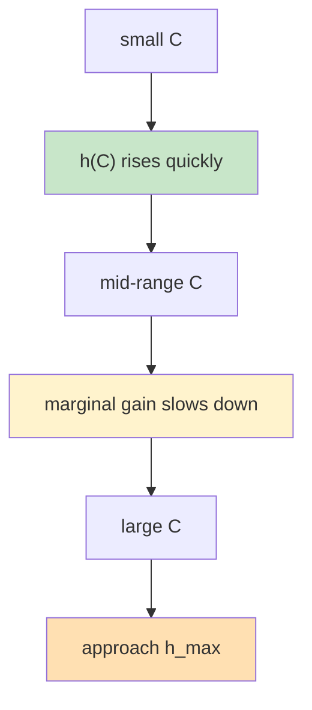

# KVCache General Analysis Framework: Four-Layer Model

> **"First answer how much can be hit for a given amount of cache, then answer how much throughput those hits translate into; machine count is just the last post-processing step."**
> This document is intended for external presentation, defining a KVCache analysis framework that is as concise, computable, and extensible as possible. The project consistently presents four layers externally: `Working Set Structure -> Capacity Hit Rate -> Hit-Driven Throughput -> Throughput-Driven Machine Count`.

---

## 1. Core Questions

A general KVCache analysis framework must externally answer four layers of questions:

1. **What is the working set structure?** Are there shared prefixes, private contexts, or an obvious reuse ceiling?
2. **Given cache capacity `C`, what is the approximate hit rate `h(C)`?**
3. **Given a hit rate `h`, how much can throughput `TPS(h)` be improved?**
4. **If total demand is fixed, how does machine demand change?**

Question 4 is not part of the main model; it is the post-processing of question 3.


The external main line stops here:

- First describe the workload structure
- Then estimate hits
- Then compute throughput
- Finally, if needed, convert to machine count

---

## 2. Main Model

### 2.1 Capacity-Hit-Rate Model

The first step of the main model is to define:

```text
h = h(C)
```

Where:

- `C`: effective KVCache capacity, which can be expressed in `tokens`, `blocks`, or `bytes`
- `h(C)`: hit rate when capacity is `C`

### Two Input Modes

#### Mode A: With profile / trace

If a workload trace or replay profile is already available, `h(C)` can be computed directly by the analyzer.

In this case, the framework does not require exposing specific solver details externally; regardless of whether the underlying implementation uses:

- Upper-bound analysis
- Policy simulation
- Replay statistics
- Trace fitting

The final external output is unified into the same object:

```text
capacity -> hit curve
```

#### Mode B: Without profile

If there is no trace, a simple, stable, and explainable approximation function is needed. A saturation curve is recommended:

```text
h(C) = h_max * (1 - exp(-(C / C50)^p))
```

Where:

- `h_max`: the maximum achievable hit rate
- `C50`: the capacity scale at which half the effect is reached
- `p`: curve steepness

The advantages of this curve:

- Naturally satisfies diminishing marginal returns
- Intuitively expresses "the closer to the limit, the less worthwhile additional cache becomes"
- Easy to fit with a small number of observation points
- Not bound to any specific cache policy

### Intuitive Shape



### What This Model Answers

It answers:

- How much cache is needed to reach a target hit rate
- Whether further cache increases still yield significant gains
- The capacity sensitivity differences across workloads

It does not directly answer:

- Whether a specific cache policy already reaches this curve
- How much throughput will increase
- How much machine count will decrease

These belong to the next two layers of mapping.

---

### 2.2 Hit-Rate-to-TPS Model

The second step maps hit rate to throughput improvement. The simplest and most stable first-order model exposed externally is:

```text
TPS(C) = TPS0 / (1 - alpha * h(C))
```

Where:

- `TPS0`: baseline throughput at zero hit rate
- `h(C)`: hit rate at capacity `C`
- `alpha`: fraction of prefill compute saved by a hit

It can also be written as a throughput amplification factor:

```text
gamma(h) = 1 / (1 - alpha * h)
```

And:

```text
TPS(C) = TPS0 * gamma(h(C))
```

### Why This Form Is Good Enough

The core advantages of this model:

- Machine count has been factored out
- The main line focuses only on per-machine or per-GPU normalized throughput
- Very easy to explain to external users
- Easy to calibrate against real measurements

### Intuitive Meaning

- As `h(C)` grows, more prefill compute is skipped
- When `alpha` is large, hits have a stronger effect on throughput
- When `alpha * h(C)` approaches 1, cache reuse has an extremely strong impact on throughput

### Usage Boundaries

This model is suitable as a public-facing first-order approximation, but its scope must be made clear:

- The main bottleneck comes from prefill
- Decode overhead does not decrease linearly with hit rate
- The goal is to estimate throughput gain, not to precisely simulate scheduling details

It does not directly model:

- Scheduling queue changes
- Batch shape changes
- Remote KV transfer bandwidth
- Access pattern changes induced by feedback

If these issues must be handled precisely, they should be addressed by a more detailed internal analysis engine, not allowed to pollute the public main formula.

---

### 2.3 TPS-to-Machine-Count Relation

Machine count should not enter the main model; it should be computed as a separate post-processing step.

If total system demand is `Q` and `TPS(C)` is per-machine throughput, then:

```text
Machines(C) = Q / TPS(C)
```

The point of this step:

- The main model only discusses `C -> h -> TPS`
- Machine count just projects the throughput result onto deployment scale

The recommended presentation order is therefore always:

```text
Capacity -> Hit Rate -> TPS -> Machines
```

Rather than:

```text
Machines -> Capacity -> Hit Rate -> TPS
```

The latter tends to mix deployment scale, resource supply, and workload itself together.

---

## 3. Without-Profile Estimation

If no full trace is available, the framework still needs to provide a usable starting point. The currently recommended approach has two tiers:

### 3.1 Tier 1: The Simplest Saturation Curve

If you only want to fit a stable curve first, you can use:

```text
h(C) = h_max * (1 - exp(-(C / C50)^p))
```

Its advantages:

- Few parameters
- Diminishing marginal returns are naturally guaranteed
- Suitable for fitting with a small number of observation points

### 3.2 Tier 2: Multi-Agent Concurrent Heuristic

If you want a bit more structural information than a single curve, but still without depending on a trace, use:

```text
shared prefix + private working set + curve shape
```

First define:

```text
P = (1 / T) * sum_{i=0}^{T-1} min(W, i * Delta)
W_total = S + n * P
L_request = S + Delta + P
h_content = (S + P) / L_request
```

Where:

- `n`: number of concurrent agents
- `S`: shared prefix tokens
- `Delta`: new tokens added per turn
- `T`: average number of session turns
- `W`: per-agent private window

Then map capacity to private working-set coverage ratio:

```text
r = clip((C - S) / (n * P), 0, 1)
```

Then use the shape function `g(r)` to estimate private-portion coverage:

```text
h_strict_est(C) = min(h_content, (S + g(r) * P) / L_request)
```

### 3.3 Three Curve Shapes

| Mode | Formula | Explanation |
|------|---------|-------------|
| `linear` | `g(r) = r` | The simplest linear coverage |
| `power_law_fit` | `g(r) = r^(1 - 1/s)` | Directly absorbs the Zipf-inspired simplified formula |
| `zipf_harmonic` | `g(r) = H_{floor(rN), s} / H_{N, s}` | Uses discrete Zipf cumulative mass for a more stable shape approximation |

Here `power_law_fit` corresponds to the common form:

```text
h(C) ~= (C / W_total)^(1 - 1/s)
```

This formula is useful, but it is an empirical approximation, not a rigorous proof.

### 3.4 Policy Approximation

Without a trace, you cannot precisely replay online LRU, so the framework only provides an `LRU-like` approximation:

```text
r_lru = clip(eta * (C - S) / (n * P), 0, 1)
```

Where `eta in (0, 1]` represents the effective-capacity discount coefficient of the online policy.

Then:

```text
h_lru_like_est(C) = min(h_content, (S + g(r_lru) * P) / L_request)
```

### 3.5 Public Naming

Externally, this path must be clearly called `heuristic`. It must not be described as:

- strict-prefix oracle
- real LRU simulation
- a proven hit rate

Its correct positioning:

- Cold-start estimation
- First-pass capacity planning
- The first version of resource budget before a profile arrives

### 3.6 Trace Calibration

If a small representative trace is already available, the framework allows one more lightweight calibration step:

- Fix the structure-layer parameters
- Calibrate `zipf_s` against trace observations
- Calibrate `LRU-like efficiency` against trace observations

But the public naming for this step must remain restrained:

- It is `calibration`, not `proof`
- It can only state "this parameter set fits this sample better"
- If `content ceiling` still clearly does not align, the issue lies in the structural assumptions, not in the curve parameters themselves

### 3.7 Trace Structure Suggestion

If `content_gap` is large, the framework takes one more step:

- Instead of only tuning `zipf_s / LRU-like`
- Directly back out `shared prefix / Delta / T / W / n` from the session shape of the trace
- Generate a `recommended_heuristic_config.json`

The meaning of this config is "let the heuristic structure template be reset first", not "the workload is proven to look like this".

---

## 4. Parameter Reference

| Symbol | Meaning | Note |
|--------|---------|------|
| `C` | Effective cache capacity | Can be expressed in `tokens / blocks / bytes` |
| `h(C)` | Hit rate at capacity `C` | Main analysis target |
| `h_max` | Maximum achievable hit rate | Workload ceiling |
| `C50` | Half-saturation capacity | Capacity scale parameter |
| `p` | Curve steepness | Shape parameter |
| `n` | Concurrent agent count | Structure-layer input |
| `S` | Shared prefix tokens | Shared by all agents |
| `Delta` | New tokens added per turn | Per-turn increment |
| `T` | Average session turns | Session depth |
| `W` | Private window | Per-agent context limit |
| `P` | Average reusable private tokens per agent | `append-only` average result |
| `s` | Zipf shape parameter | Used only by `power_law_fit / zipf_harmonic` |
| `eta` | Online policy efficiency coefficient | Used to approximate `LRU-like` loss |
| `TPS0` | Baseline throughput | Per-machine throughput at zero hit rate |
| `alpha` | Prefill saving fraction | Fraction of hits convertible to throughput gain |
| `TPS(C)` | Throughput at capacity `C` | `TPS0 / (1 - alpha * h(C))` |
| `Q` | Total demanded throughput | Used for machine-count post-processing |
| `Machines(C)` | Required machine count | `Q / TPS(C)` |

---

## 5. Recommended Output Format

A public framework is best suited to output the following set of objects:

### 5.1 Main Curves

- `capacity -> hit`
- `capacity -> TPS`
- `capacity -> machines` (optional)

### 5.2 Key Points

- Capacity required to reach a target hit rate
- Capacity required to reach a target TPS gain
- Capacity range where marginal gains start to slow
- Capacity range approaching saturation

### 5.3 Recommended Header

| Capacity | Hit Rate | TPS Gain | TPS | Machines Needed |
|----------|----------|----------|-----|-----------------|
| `C1` | `h(C1)` | `gamma(h(C1))` | `TPS(C1)` | `Q / TPS(C1)` |

The advantages of this output format:

- The main line is very stable
- Suitable for both planning and comparison
- Suitable for both with-profile and without-profile scenarios

---

## 6. Engineering Implementation Suggestions

The public main document does not need to expand on all internal solver details, but engineering-wise it is recommended to split the analyzer into four engines:

| Engine | Role |
|--------|------|
| **Structure Engine** | Describe shared prefix, private working set, concurrency, etc. |
| **Hit Engine** | Generate `h(C)`, supporting trace/profile or parameterized estimation |
| **TPS Engine** | Map `h(C)` to `TPS(C)` |
| **Sizing Engine** | Project `TPS(C)` onto machine demand or resource savings |

Regardless of whether finer-grained internal layering is used, the external API is recommended to be fixed as:

```text
Capacity -> Hit -> TPS -> Machines
```

This keeps the framework most generic and explainable.

---

## 7. Summary

| Conclusion | Explanation |
|------------|-------------|
| The external main line should be as short as possible | Fixed as `Working Set -> Capacity -> Hit -> TPS -> Machines` |
| Machine count should not enter the main formula | It is just post-processing of throughput results |
| Without-profile estimation should first explain working-set structure | Shared/private first, then choose curve shape |
| Complex solver details should be hidden in internal engines | Do not pollute the public framework expression |

The most important value of this general analysis framework:

> **It compresses the KVCache problem into a simple, stable, computable four-layer main chain: first describe the working set, then estimate hits, then compute throughput, and finally make capacity and machine-scale decisions.**
