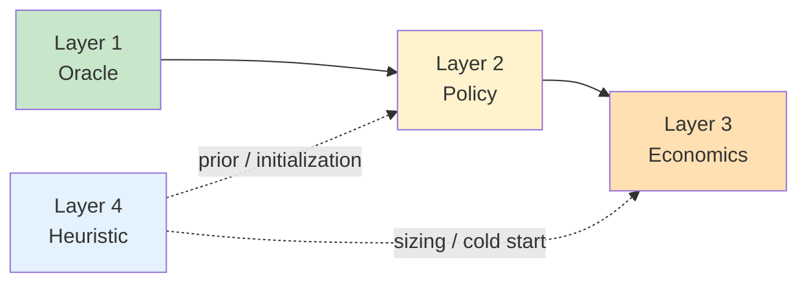
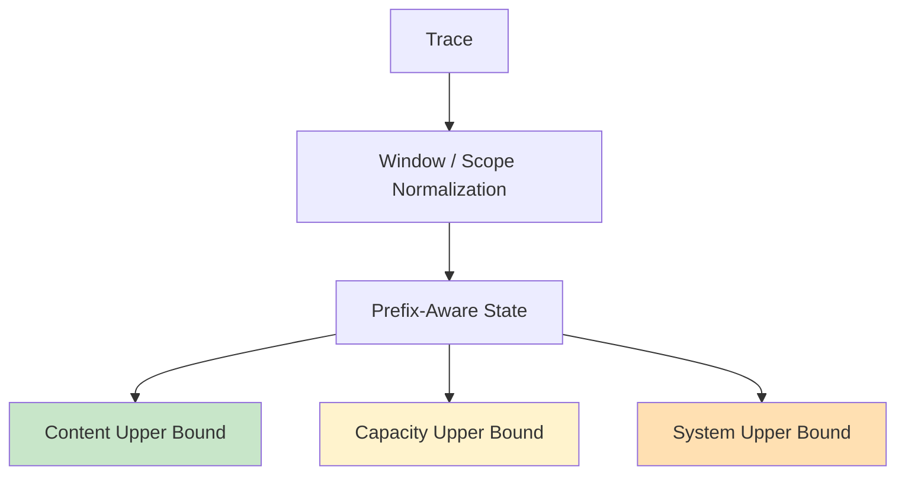
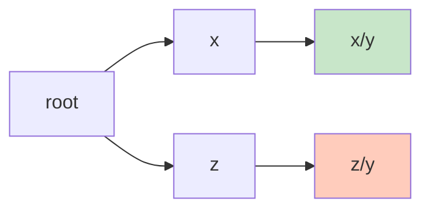
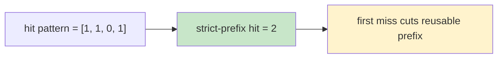
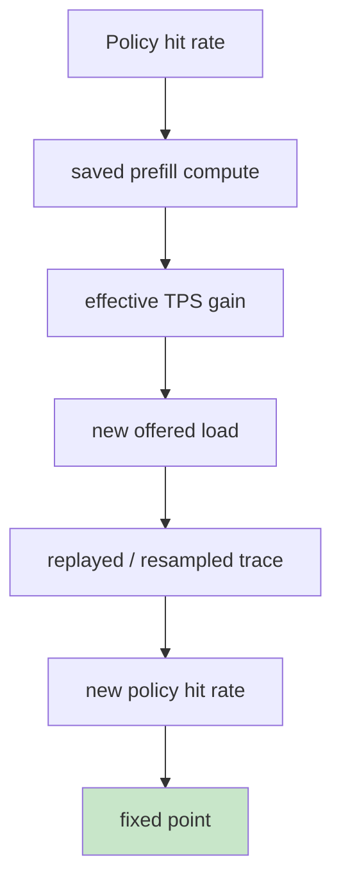
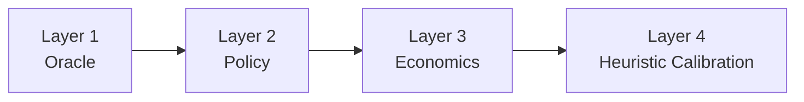

# KVCache 通用分析框架：四层架构设计

> **“不要把上界、策略、收益和粗估混成同一条曲线；先分层，再求解，最后再闭环。”**
> 这份文档定义一个面向通用推理系统的 KVCache 分析框架。它适用于不同模型、不同缓存介质、不同部署规模，也适用于从离线容量规划到在线策略评估的完整分析链路。

---

## 1. 设计目标

KVCache 相关问题通常表面上只是在问“要配多大缓存”，但真正需要回答的是一组层层递进的问题：

1. 在给定 workload 下，**理论上最多** 能复用多少 KV？
2. 某个具体缓存系统，**实际上** 能保住多少命中？
3. 这些命中带来的 prefill 节省，能换来多少 **TPS 提升或机器节约**？
4. 如果没有 trace，能否用少量统计量对容量需求做 **快速估算**？

这四个问题不是同一个数学对象，也不应该由同一条公式直接回答。为避免口径混乱，KVCache 分析框架应固定拆成四层：



---

## 2. 四层总览

| 层级 | 核心问题 | 典型输入 | 核心输出 | 本质定位 |
|------|----------|----------|----------|----------|
| **Layer 1: Oracle** | 理论上最多能命中多少？ | trace + model + budget | 上界曲线 / 精确最优值 / 证书 | 数学上界 |
| **Layer 2: Policy** | 某个缓存系统实际会命中多少？ | trace + policy + budget | 策略曲线 / 实际命中率 | 系统行为模拟 |
| **Layer 3: Economics** | 命中率能换来多少吞吐或机器收益？ | policy result + service profile | TPS gain / machine saved / fixed point | 资源收益模型 |
| **Layer 4: Heuristic** | 无 trace 时怎么快速估量容量？ | 少量统计量 / 经验参数 | 粗粒度 sizing curve | 先验估算 |

### 2.1 分层原则

- **Layer 1 不模拟策略**，只回答理论极限。
- **Layer 2 不冒充上界**，只回答具体系统行为。
- **Layer 3 不直接产生命中率**，而是把命中率映射成资源收益。
- **Layer 4 不替代真实分析**，只在缺少 trace 时提供粗估。

### 2.2 常见错误

| 错误做法 | 问题 |
|---------|------|
| 用上界结果代替真实系统命中率 | 过度乐观 |
| 用某个策略模拟结果代替理论上界 | 失去最优性参照 |
| 用 TPS 放大公式直接反推命中率 | 忽略访问流结构变化 |
| 用 Zipf 或 shared/private 模型替代真实 trace | 误差不可控 |

---

## 3. Layer 1: Oracle

### 3.1 目标

Oracle 层只回答一个问题：

**给定 trace、窗口语义、模型配置和容量预算，在定义好的复用语义下，理论上最多能复用多少 KV。**

它回答的是上界，而不是某个具体系统已经达到的结果。

### 3.2 输入与输出

### 输入

- 请求 trace
- window 策略
- 复用 scope
- 模型 profile
- 容量预算
- 可选的带宽/时限参数

### 输出

- `content upper bound`
- `capacity upper bound`
- `system upper bound`
- `block/token/kv-byte` 三类命中率
- 对精确值的证明信息或上下界证书

### 3.3 Oracle 内部再分三层



| 子层 | 回答的问题 | 是否需要容量信息 |
|------|------------|------------------|
| **content** | 内容本身最多能复用多少？ | 否 |
| **capacity** | 有限空间下还能保住多少？ | 是 |
| **system** | 带宽和时间窗口下最终能搬到多少？ | 是 |

### 3.4 语义要求

### 3.4.1 复用对象必须是前缀路径，而不是平坦 key

对 LLM prefill 而言，可复用对象不是“曾经见过某个 block hash”，而是“曾经出现过相同前缀路径上的状态”。



`x/y` 和 `z/y` 虽然最后一个 block 都是 `y`，但它们不代表同一个可复用前缀状态。

### 3.4.2 strict-prefix 是核心语义

只有从请求第一个 block 开始连续命中的那一段，才构成真正可复用的前缀。



### 3.4.3 Prefill / Decode 分界

第一类核心指标只统计 prefill 复用：

- 输入前缀能否复用，计入命中
- decode 产生的新 token KV，不进入主命中率
- decode 只在 Layer 3 的收益映射中进入计算

### 3.5 核心公式

### 3.5.1 模型尺寸进入容量计算的方式

对标准 Transformer / GQA，单 token KV 大小定义为：

```python
from dataclasses import dataclass

@dataclass(frozen=True)
class ModelProfile:
    n_layers: int
    n_kv_heads: int
    head_dim: int
    dtype_bytes: int
    kv_cache_layer_count: int | None = None
    block_size: int = 16

    def kv_bytes_per_token(self) -> int:
        layers = self.n_layers if self.kv_cache_layer_count is None else self.kv_cache_layer_count
        return 2 * layers * self.n_kv_heads * self.head_dim * self.dtype_bytes

    def kv_bytes_per_block(self) -> int:
        return self.block_size * self.kv_bytes_per_token()
```

其中：

- `2` 表示 `K + V`
- `n_kv_heads` 必须使用 KV 头数，而不是 attention 总头数
- 混合注意力模型必须显式提供 `kv_cache_layer_count`

### 3.5.2 三类上界的关系

```text
content upper bound >= capacity upper bound >= system upper bound
```

更细一点：

```text
content upper bound >= relaxed capacity upper bound >= exact strict-prefix capacity >= realizable policy result
```

### 3.6 Layer 1 的价值

能回答：

- workload 的理论复用极限
- 多加空间是否还有理论收益
- 哪些分桶已经接近内容天花板
- 某个真实策略离理论最优还差多少

不能直接回答：

- 某个具体系统当前到底命中多少
- TPS 会提升多少
- 机器数应该缩减多少

---

## 4. Layer 2: Policy

### 4.1 目标

Policy 层回答：

**给定一个具体缓存系统、调度规则和容量分层，它在相同输入流上实际能做到多少命中。**

典型系统包括：

- `LRU`
- `LFU`
- `TTL`
- `admission control`
- `HBM + host spill`
- `HBM + SSD spill`
- 分级 promotion / demotion

### 4.2 它与 Oracle 的区别

| 维度 | Oracle | Policy |
|------|--------|--------|
| 目标 | 理论最优 | 特定系统行为 |
| 是否证明最优 | ✅ | ❌ |
| 是否依赖策略细节 | 低 | 高 |
| 是否可直接映射具体系统 | 间接 | 直接 |

### 4.3 经典 LRU 在这里的位置

经典 reuse distance / stack distance 理论最适合出现在 Policy 层，因为它描述的是：

- 给定访问流
- 给定 LRU 策略
- 给定容量 `C`
- event-level cache hit 会是多少

典型形式：

```text
h(C) = P(reuse_distance < C)
```

这可以成为一个非常好的 baseline，但它不是全部。

### 4.4 为什么 flat-key LRU 不足以覆盖 LLM prefix reuse

对 LLM workload 来说，至少要区分两种策略建模：

| 建模方式 | 优点 | 缺点 | 适用性 |
|----------|------|------|--------|
| **Flat-key LRU** | ✅ 实现简单 | ❌ 不符合 strict-prefix 复用语义 | 只适合 baseline |
| **Prefix-aware LRU** | ✅ 与前缀复用一致 | ❌ 状态更复杂 | 推荐主路线 |

### 4.5 Layer 2 的建议输出

- `policy_block_hit_rate`
- `policy_strict_prefix_hit_rate`
- `policy_token_hit_rate`
- `policy_kv_byte_hit_rate`
- `policy_vs_oracle_gap`
- 分层介质命中分解：`HBM / host / SSD / remote`

### 4.6 Layer 2 的推荐接口

```python
from dataclasses import dataclass

@dataclass(frozen=True)
class PolicyConfig:
    name: str
    resident_block_capacity: int
    allow_no_admit: bool = True
    host_block_capacity: int = 0
    ssd_block_capacity: int = 0
    ttl_ms: int | None = None
```

---

## 5. Layer 3: Economics

### 5.1 目标

Economics 层回答：

**命中率提升以后，节省下来的 prefill 计算最终能转成多少 TPS 提升、多少机器节约，或者多少额外流量承载能力。**

它不是上界模型，也不是缓存策略模型，而是资源收益映射层。

### 5.2 基本计算链



这条链表达的是：

- 命中率本身不会直接变成收益
- 它先变成 prefill 节省
- prefill 节省再变成吞吐释放
- 吞吐释放会改变输入流密度
- 输入流密度变化又会反过来影响命中率

### 5.3 一阶近似公式

如果系统满足：

- prefill 是主要瓶颈
- decode 开销近似独立
- 输入流形态在短期内近似同分布

可以用一阶近似：

```text
gamma(h) = 1 / (1 - alpha * h)
```

其中：

- `h`：命中率
- `alpha`：命中后节省的计算比例
- `gamma(h)`：吞吐放大因子

### 重要说明

这个公式只能作为 Layer 3 的近似收益映射，不能反向替代 Layer 1 或 Layer 2：

- 它不是严格 oracle
- 它不是精确策略模拟
- 它没有自动决定新的 reuse-distance 分布

### 5.4 为什么需要 fixed point

命中率提高后：

- 固定机器数时，系统会尝试提高吞吐
- 固定流量时，系统会尝试减少机器

这两种控制方式会导致不同的稳态。

因此 Layer 3 至少要支持两种问题：

| 模式 | 回答的问题 |
|------|------------|
| **fixed load** | 固定流量下可以节省多少机器？ |
| **fixed fleet** | 固定机器下可以承载多少额外流量？ |

### 5.5 推荐输出

- `prefill_saved_ratio`
- `effective_tps_gain`
- `machine_saved_at_fixed_load`
- `load_supported_at_fixed_machine`
- `fixed_point_hit_rate`
- `fixed_point_tps`

---

## 6. Layer 4: Heuristic

### 6.1 目标

Heuristic 层只在一种场景下出现：

**没有 trace、没有 profile，仍然需要快速估算 KVCache 容量的量级。**

它提供的是 sizing prior，而不是精确分析结果。

### 6.2 两类典型近似

### 6.2.1 Shared / Private 分解

将工作集拆成：

```text
W_total = W_shared + n * W_private
```

其中：

- `W_shared`：跨请求或跨会话共享的部分
- `W_private`：单个并发体私有的部分
- `n`：有效并发数

### 6.2.2 Zipf 频率近似

如果访问频率满足 Zipf 分布，可写成：

```text
h(C) ≈ (C / W_total)^(1 - 1 / s)
```

其中：

- `C`：缓存容量
- `W_total`：总工作集
- `s`：Zipf 参数

### 6.3 更合理的共享结构

对 LLM 前缀复用，二项式的 `shared + private` 仍然过于粗糙。更有解释力的结构是分层共享：

| 层次 | 典型来源 | 共享范围 |
|------|----------|----------|
| **global shared** | system prompt / common tools | 全局 |
| **class shared** | agent template / domain scaffold | 某一类请求 |
| **session shared** | 同一会话上下文 | 单会话 |
| **tail private** | 最近窗口 / 用户特定上下文 | 单请求 |

### 6.4 Layer 4 的定位

能做：

- 冷启动容量估算
- 采购前的粗粒度 sizing
- 为 Layer 1/2 提供初始实验点

不能做：

- 替代真实 trace 分析
- 直接作为上线前容量结论
- 直接解释 strict-prefix exact 结果

---

## 7. 层间契约

一个可复用的通用框架，关键不是把所有东西塞进一个模拟器，而是定义清楚层间契约。

### 7.1 Oracle -> Policy

Oracle 提供：

- 内容天花板
- 容量天花板
- 精确值或紧上界

Policy 必须输出：

- 自己离 Oracle 还有多远
- 差距来自哪种策略约束

### 7.2 Policy -> Economics

Policy 提供：

- 命中率
- 介质分布
- 每种命中的 prefill 节省结构

Economics 再把它映射为：

- TPS gain
- machine saved
- fixed-point load

### 7.3 Heuristic -> Oracle / Policy

Heuristic 只能提供：

- 初始容量猜测
- 参数先验
- profile 缺失时的实验起点

不能直接覆盖 Oracle / Policy 的结果。

---

## 8. 推荐实现顺序

### 方案一：先做理论，再做真实系统 ⭐



优点：

- ✅ 先拿到硬上界
- ✅ 后续所有策略都有参照物
- ✅ 收益评估不会失去边界感

缺点：

- ❌ 前期距离具体系统实现还有一层抽象

### 方案二：先做策略模拟，再补理论上界

优点：

- ✅ 很快能得到策略曲线

缺点：

- ❌ 不知道离最优差多远
- ❌ 容易把策略限制误当成工作负载本身的限制

### 最终建议

| 路线 | 可解释性 | 风险 | 建议 |
|------|----------|------|------|
| **先做 Oracle** | ✅ 高 | 低 | ⭐ 推荐 |
| **先做 Policy** | 中 | 高 | 仅适合快速 baseline |

---

## 9. 对外展示建议

如果这套框架用于对外说明，建议始终按下面顺序介绍：

1. **先讲四层问题定义**
2. **再讲 Layer 1 的严格语义和数学边界**
3. **再讲 Layer 2 如何承接真实缓存系统**
4. **再讲 Layer 3 如何把命中率转成资源收益**
5. **最后讲 Layer 4 如何在缺少数据时快速估算**

最忌讳的展示方式是：

- 一上来就给一条“容量-命中率曲线”
- 不说明它是上界、策略结果，还是 heuristic
- 再用同一条曲线去解释 TPS 和机器收益

这样会让读者误以为所有数字都来自同一个模型。

---

## 10. 总结

| 结论 | 说明 |
|------|------|
| KVCache 分析不是单层问题 | 至少应拆成 Oracle / Policy / Economics / Heuristic 四层 |
| 上界必须独立存在 | 没有 Oracle，就无法判断真实系统离极限还有多远 |
| 策略曲线不能替代理论上界 | Policy 只描述系统行为，不描述数学最优 |
| 收益模型必须闭环 | 命中率会反过来影响负载与吞吐 |
| 无 trace 估算只能做先验 | Heuristic 只能缩小搜索空间，不能替代真实分析 |

这套四层框架的核心价值在于：

> **把“能做到多少”“会做到多少”“值不值得做”“没数据时怎么估”这四件事彻底切开，再用清晰的接口把它们重新接起来。**
