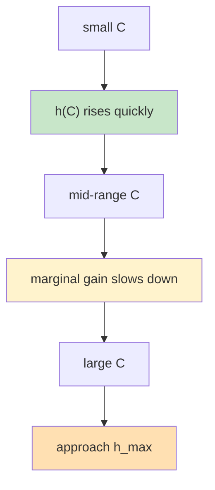

# KVCache 通用分析框架：容量、命中与吞吐

> **“先回答给多少缓存能命中多少，再回答这些命中能换来多少吞吐；机器数只是最后一层后处理。”**
> 这份文档面向对外展示，定义一个尽量简洁、可计算、可扩展的 KVCache 分析框架。主线只保留最关键的三个关系：`容量 -> 命中 -> TPS`，以及在缺少 profile 时的近似估计方法。

---

## 1. 核心问题

一个通用的 KVCache 分析框架，最需要回答的是三件事：

1. **给定缓存容量 `C`，命中率 `h(C)` 大概是多少？**
2. **给定命中率 `h`，吞吐 `TPS(h)` 能提升多少？**
3. **如果总需求固定，机器需求会如何变化？**

其中第 3 个问题不是主模型，而是第 2 个问题的后处理。


对外主线到这里就够了：

- 先估命中
- 再算吞吐
- 最后如有需要，再换算机器数

---

## 2. 主模型

### 2.1 容量-命中率模型

主模型的第一步是定义：

```text
h = h(C)
```

其中：

- `C`：有效 KVCache 容量，可以用 `tokens`、`blocks` 或 `bytes` 表示
- `h(C)`：容量为 `C` 时的命中率

### 两种输入方式

#### 方式 A：有 profile / trace

如果已经有 workload trace 或 replay profile，那么 `h(C)` 可以直接由分析器计算得到。

这时框架并不要求对外暴露具体求解器细节；无论底层使用：

- 上界分析
- 策略模拟
- replay 统计
- trace 拟合

最终对外输出都统一成同一个对象：

```text
capacity -> hit curve
```

#### 方式 B：没有 profile

如果没有 trace，需要一个简单、稳定、可解释的近似函数。推荐使用饱和型曲线：

```text
h(C) = h_max * (1 - exp(-(C / C50)^p))
```

其中：

- `h_max`：可达到的最大命中率
- `C50`：达到一半效果所需的容量尺度
- `p`：曲线陡峭程度

这条曲线的好处是：

- 天然满足边际收益递减
- 直观表达“越接近极限，继续加缓存越不值”
- 易于用少量观测点拟合
- 不绑定某种特定缓存策略

### 直观形状



### 这个模型回答什么

它回答：

- 多大的缓存能达到目标命中率
- 继续增加缓存是否还有显著收益
- 不同 workload 的容量敏感性差异

它不直接回答：

- 某个具体缓存策略是否已经达到这个曲线
- 吞吐会增加多少
- 机器数会减少多少

这些属于后两层映射。

---

### 2.2 命中率-TPS 模型

第二步是把命中率映射为吞吐提升。对外最简洁、最稳定的一阶模型是：

```text
TPS(C) = TPS0 / (1 - alpha * h(C))
```

其中：

- `TPS0`：零命中时的基线吞吐
- `h(C)`：容量 `C` 下的命中率
- `alpha`：命中后可节省的 prefill 计算比例

也可以写成吞吐放大因子：

```text
gamma(h) = 1 / (1 - alpha * h)
```

以及：

```text
TPS(C) = TPS0 * gamma(h(C))
```

### 为什么这个形式足够好

这个模型的核心优点是：

- 机器数已经被剥离出去
- 主线只关注单机或单 GPU 的归一化吞吐
- 非常容易解释给外部用户
- 容易和真实测量值做校准

### 直观含义

- 当 `h(C)` 增大时，被跳过的 prefill 计算更多
- 当 `alpha` 较大时，命中对吞吐更敏感
- 当 `alpha * h(C)` 接近 1 时，说明缓存复用对吞吐影响极强

### 使用边界

这个模型适合作为公开版的一阶近似，但必须明确它的适用范围：

- 主要瓶颈来自 prefill
- decode 开销不随命中率同步线性下降
- 目标是估算吞吐收益，而不是精确模拟调度细节

它不直接建模：

- 调度队列变化
- 批处理形状变化
- 远端 KV 搬运带宽
- 反馈引起的访问模式变化

如果这些问题必须精确处理，应由更细的内部分析引擎单独承担，而不应污染公开主公式。

---

### 2.3 TPS-机器数关系

机器数不应进入主模型，而应作为后处理单独计算。

如果系统总需求为 `Q`，而 `TPS(C)` 是单机吞吐，则：

```text
Machines(C) = Q / TPS(C)
```

这一步的意义是：

- 主模型只讨论 `C -> h -> TPS`
- 机器数只是把吞吐结果投影到部署规模上

因此推荐的展示顺序始终是：

```text
Capacity -> Hit Rate -> TPS -> Machines
```

而不是：

```text
Machines -> Capacity -> Hit Rate -> TPS
```

后者容易把部署规模、资源供给和工作负载本身混在一起。

---

## 3. 无 Profile 估计

如果没有完整 trace，框架仍然需要能给出一个可用的起点。推荐采用“参数化曲线 + 少量锚点”的方法，而不是直接构造复杂的策略模拟。

### 3.1 最简三参数模型

继续使用：

```text
h(C) = h_max * (1 - exp(-(C / C50)^p))
```

这时问题就变成：如何得到 `h_max`、`C50` 和 `p`。

### 3.2 三个参数的解释

| 参数 | 含义 | 直观解释 |
|------|------|----------|
| `h_max` | 最大可达命中率 | workload 本身的复用天花板 |
| `C50` | 半饱和容量 | 从“明显不够”到“开始够用”的容量尺度 |
| `p` | 陡峭程度 | workload 的集中度和边际收益形状 |

### 3.3 推荐的获取方式

#### 方式 A：三点轻量标定

即便没有完整 profile，也建议至少测 3 个容量点：

- 小容量点
- 中等容量点
- 接近饱和的容量点

然后拟合 `(h_max, C50, p)`。

这样通常已经足够得到一条稳定的近似曲线。

#### 方式 B：模板初始化

如果连 3 个点都没有，可以用 workload 模板初始化参数，例如：

- `high-reuse`
- `medium-reuse`
- `low-reuse`

模板本身不是结论，只是冷启动 prior。后续一旦有少量观测点，就应用观测值覆盖模板参数。

### 3.4 为什么不直接对外讲更复杂的估算器

对外文档不建议把无 profile 估计写成过于复杂的：

- 并发 agent 分解
- shared/private 多层工作集
- Zipf 多参数建模
- 多层反馈闭环

这些方法并不是不能做，而是：

- 参数更多
- 可解释性更差
- 容易让读者误以为它们比真实 profile 更精确

因此公开版只推荐保留“少参数、可拟合、边际收益递减”的近似曲线。

---

## 4. 参数说明

| 符号 | 含义 | 备注 |
|------|------|------|
| `C` | 有效缓存容量 | 可用 `tokens / blocks / bytes` 表示 |
| `h(C)` | 容量 `C` 下的命中率 | 主分析对象 |
| `h_max` | 最大可达命中率 | workload 天花板 |
| `C50` | 半饱和容量 | 容量尺度参数 |
| `p` | 曲线陡峭度 | 形状参数 |
| `TPS0` | 基线吞吐 | 零命中时的单机吞吐 |
| `alpha` | prefill 节省比例 | 命中后可转化为吞吐收益的比例 |
| `TPS(C)` | 容量 `C` 下的吞吐 | `TPS0 / (1 - alpha * h(C))` |
| `Q` | 总需求吞吐 | 用于后处理机器数 |
| `Machines(C)` | 所需机器数 | `Q / TPS(C)` |

---

## 5. 推荐输出格式

一个公开框架最适合输出下面这组对象：

### 5.1 主曲线

- `capacity -> hit`
- `capacity -> TPS`
- `capacity -> machines`（可选）

### 5.2 关键点

- 达到目标命中率所需容量
- 达到目标 TPS 增益所需容量
- 边际收益开始变缓的容量区间
- 接近饱和的容量区间

### 5.3 推荐表头

| Capacity | Hit Rate | TPS Gain | TPS | Machines Needed |
|----------|----------|----------|-----|-----------------|
| `C1` | `h(C1)` | `gamma(h(C1))` | `TPS(C1)` | `Q / TPS(C1)` |

这种输出形式的好处是：

- 主线非常稳定
- 既能做规划，也能做对比
- 既适合有 profile，也适合无 profile 场景

---

## 6. 工程实现建议

对外主文档不需要展开所有内部求解细节，但工程上建议把分析器分成三类引擎：

| 引擎 | 作用 |
|------|------|
| **Hit Engine** | 生成 `h(C)`，支持 trace/profile 或参数化估计 |
| **TPS Engine** | 把 `h(C)` 映射成 `TPS(C)` |
| **Sizing Engine** | 把 `TPS(C)` 投影到机器需求或资源节省 |

无论底层是否采用更细的分层实现，对外 API 都建议固定为：

```text
Capacity -> Hit -> TPS -> Machines
```

这样最容易保持框架的通用性与可解释性。

---

## 7. 总结

| 结论 | 说明 |
|------|------|
| 对外主线应尽量短 | 只保留 `容量 -> 命中 -> TPS` |
| 机器数不应进入主公式 | 它只是吞吐结果的后处理 |
| 无 profile 估计应使用少参数曲线 | 优先保证可解释性，而不是堆复杂度 |
| 复杂求解细节应隐藏在内部引擎中 | 不污染公开框架表达 |

这个通用分析框架最重要的价值在于：

> **把 KVCache 问题压缩成一个简单、稳定、可计算的主链条：先估命中，再算吞吐，最后再做容量与机器规模决策。**
