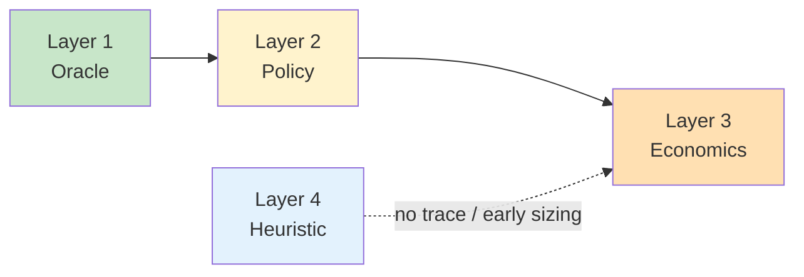
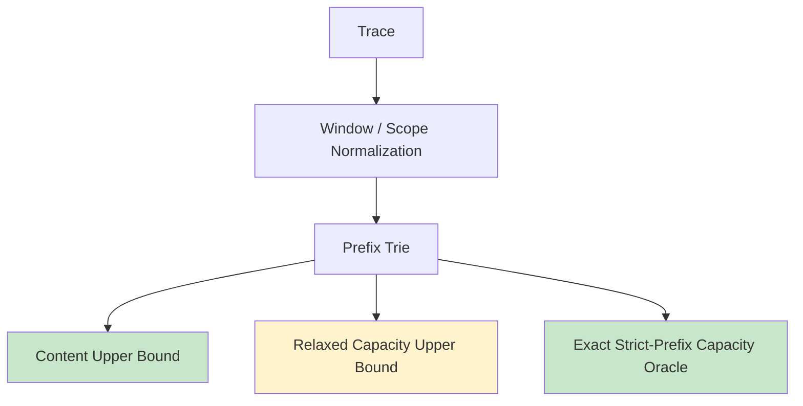
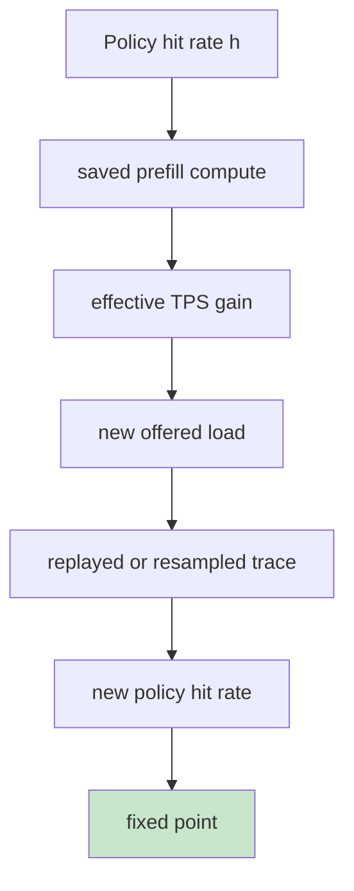

# KVCache 规划四层模型：上界、策略、收益与估算

> **“先分清你在算上界、在模拟策略，还是在做收益闭环；把这三件事混成一条曲线，最后一定谁都解释不清。”**
> 这份文档把整体分析问题重写成一个四层框架。它的目的不是替代当前实现，而是给当前实现一个正确的位置，并给后续演进划清边界。

---

## 背景：为什么必须重写成四层

这个通用框架真正想回答的问题其实不是一个，而是一串因果链：

1. **理论上** 这个 workload 最多能复用多少 KV？
2. **某个具体缓存系统** 实际能保住多少命中？
3. 命中率提升后，**GPU prefill 负载** 能下降多少？
4. 这些节省能不能转成 **更高 TPS 或更少机器**？
5. 如果没有 trace，能不能用 **统计模型** 快速估个量级？

这五个问题不是同一层。当前仓库已经把第一个问题做得很扎实，但第二、第三、第四、第五个问题还不能和第一个问题混写成同一个公式。



最核心的架构判断是：

- **Layer 1** 解决“上限”
- **Layer 2** 解决“真实系统行为”
- **Layer 3** 解决“收益闭环”
- **Layer 4** 解决“无 trace 时的粗估”

---

## 四层一览

| 层级 | 回答的问题 | 输入 | 输出 | 当前状态 |
|------|------------|------|------|----------|
| **Layer 1: Oracle** | 理论上最多能命中多少？ | trace + model + budget | `content/capacity/system` upper bound | ✅ `content` 和 `strict-prefix capacity` 已实现 |
| **Layer 2: Policy** | 某个缓存系统实际能命中多少？ | trace + policy + budget | `LRU/TTL/admission/spill` 命中率 | ❌ 未实现 |
| **Layer 3: Economics** | 命中率能换来多少 TPS / 节约多少机器？ | policy result + service profile | `TPS gain / machine saved / fixed point` | ❌ 未实现 |
| **Layer 4: Heuristic** | 没有 trace 时如何快速估算？ | 少量统计量 / 人工假设 | 粗粒度 sizing curve | ❌ 未实现 |

结论先摆在台面上：

- 当前仓库的主能力属于 **Layer 1**
- 原始分析笔记里的 `2.1 LRU` 更像 **Layer 2**
- 原始分析笔记里的 `2.2 TPS 修正模型` 属于 **Layer 3**
- 原始分析笔记里的 `2.3 Agent / Zipf` 属于 **Layer 4**

如果不这样切开，就会发生最常见的概念污染：

- 用上界数字去解释真实线上命中率
- 用策略模拟结果去当理论极限
- 用收益闭环公式去反推缓存命中
- 用无 trace 的粗估模型去替代真实 profile

---

## Layer 1：Oracle 层

### 它回答什么

Oracle 层只回答一个问题：

**给定 trace、window、模型和容量预算，这个 workload 在定义好的语义下理论最多能复用多少 KV。**

它不回答：

- 真实线上是不是 LRU
- 缓存对象怎么 admission
- host/SSD 的带宽是否来得及
- 命中率提升后 TPS 会不会反馈改变流量

### 当前仓库在这一层已经实现了什么



当前仓库在 Layer 1 内部又分成三层：

| 子层 | 定义 | 当前状态 |
|------|------|----------|
| **content upper bound** | 忽略容量，只问历史里是否已有相同前缀路径 | ✅ 已实现 |
| **capacity upper bound** | 在有限 budget 下，最多能保住多少命中 | ✅ 已实现 |
| **system upper bound** | 在容量之外，再考虑带宽和 deadline | ❌ 未实现 |

### 当前实现与经典 LRU 的关系

这里最容易误解。

当前实现的主对象不是“平坦 key”，而是“前缀路径节点”。

所以它不是经典教科书里的：

- flat key LRU
- stack distance directly over raw keys

而是：

- prefix-aware reuse object
- strict-prefix semantics
- exact oracle or provable upper bound

### Layer 1 的核心公式

对单 token KV 大小，当前项目采用：

```python
def kv_bytes_per_token(layers, kv_heads, head_dim, dtype_bytes):
    return 2 * layers * kv_heads * head_dim * dtype_bytes
```

对 `Qwen/Qwen3.5-27B` 这类混合注意力模型，还要区分：

- 总层数 `n_layers = 64`
- 真正进入 token-linear KV cache 的层数 `kv_cache_layer_count = 16`

所以当前项目里的 budget 曲线：

- **访问模式** 主要由 trace 决定
- **bytes 轴** 由模型 profile 决定

这也是为什么“命中率曲线只和访问模式有关、和模型无关”这个说法只能成立一半：

- 如果横轴是“resident blocks”，基本只和访问模式有关
- 如果横轴是“GB / HBM / 机器数”，就一定和模型有关

### Layer 1 的结果该怎么用

能用来：

- 给容量规划一个 **硬天花板**
- 判断当前 workload 是否已经接近 `content ceiling`
- 判断“多加空间”还有没有理论收益
- 给 Layer 2/3 提供上界约束

不能用来：

- 直接当真实线上命中率
- 直接当真实 TPS 提升
- 直接推断某个具体缓存策略已经达到这个数

---

## Layer 2：Policy 层

### 它回答什么

Policy 层回答：

**给定一个具体缓存系统和调度策略，它在相同 trace 上实际会做到多少命中。**

典型策略包括：

- `LRU`
- `LFU`
- `TTL`
- `admission control`
- `HBM + host spill`
- `HBM + SSD spill`

### 这才是经典复用距离理论最适合出现的地方

原始分析笔记里的这部分：

- `2.1.1 Reuse Distance`
- `2.1.2 存储空间-命中率曲线`

本质上属于 Layer 2，而不是 Layer 1。

经典 LRU 公式：

```text
h(C) = P(reuse_distance < C)
```

它回答的是：

- **在 LRU 策略下**
- **给定某个访问流**
- **容量为 C 时**
- event-level cache hit 会是多少

### 为什么它不能直接替代当前 Oracle

因为当前项目的核心语义是 strict-prefix prefill reuse：

- 复用对象是 prefix path，不是 raw key
- 关心的是“从请求开头连续命中多少 block”
- 一个后面的 block hit，并不必然带来可复用前缀

所以，Layer 2 里如果要做 LRU，至少有两种不同建模方式：

| 建模方式 | 优点 | 缺点 | 建议 |
|----------|------|------|------|
| **Flat key LRU** | ✅ 实现简单 | ❌ 不符合 strict-prefix 语义 | 只做 baseline |
| **Prefix-aware LRU** | ✅ 语义对齐 | ❌ 状态空间更大 | ⭐ 推荐主路线 |

### 当前仓库和 Layer 2 的偏差

当前仓库没有实现 Policy 层。

更准确地说，它刻意跳过了 Policy 层，直接求上界。

这不是 bug，而是设计选择：

- 先知道“最多能有多少收益”
- 再决定“某个具体策略值不值得做”

### Layer 2 建议的数据结构

```python
from dataclasses import dataclass

@dataclass(frozen=True)
class PolicyConfig:
    name: str  # lru / ttl / hbm_host / hbm_ssd
    resident_block_capacity: int
    allow_no_admit: bool
    host_block_capacity: int = 0
    ssd_block_capacity: int = 0
    ttl_ms: int | None = None
```

这层的目标不是“证明最优”，而是：

- 可重现实验
- 可比较不同策略
- 输出真实策略曲线

---

## Layer 3：Economics 层

### 它回答什么

Economics 层回答：

**命中率提升以后，节省下来的 prefill 计算，最终能换成多少 TPS 或多少机器节约？**

这一层才真正连接资源规划与部署决策。

### 原始分析笔记 2.2 的价值和局限

原始分析笔记里的思路是合理的：

- 命中率提高
- prefill 计算减少
- GPU 利用率释放
- 吞吐上升或机器数下降

但当前写法：

```text
gamma(h) = 1 / (1 - alpha * h)
```

更适合作为 **一阶启发式近似**，不应直接当精确模型。

因为真实系统里至少还受这些量控制：

- prefill / decode 比例
- batching 形状
- scheduler 限流
- tail latency 约束
- KV 搬运带宽
- 队列长度与到达过程

### 为什么 `d'_i = d_i * gamma(h)` 不是稳固结论

这里是原始分析笔记最需要收敛口径的地方。

如果 `d_i` 指的是经典 reuse distance，也就是：

- 在访问流里
- 两次相同 key 之间
- 间隔了多少不同 key

那么吞吐放大并不会自动让它线性乘 `gamma`。

只有当“输入流结构本身被重采样并叠加”时，distance 分布才会变化。而它如何变化，取决于：

- 会话并发数
- 请求长度分布
- shared prefix 覆盖率
- 调度器如何把新增请求插入时间轴

所以更稳妥的 Layer 3 结构不是：

```text
h = F(C / gamma(h))
```

而是：

```text
policy hit rate
    -> saved prefill FLOPs / bytes
    -> effective TPS gain
    -> new offered load
    -> replay / superposition
    -> new hit rate
```

### 推荐的 Layer 3 计算链



### Layer 3 推荐输出

| 指标 | 含义 |
|------|------|
| `prefill_saved_ratio` | 命中带来的 prefill 节省比例 |
| `effective_tps_gain` | 在服务 profile 下折算出的 TPS 提升 |
| `machine_saved_at_fixed_load` | 固定流量下可减少的机器数 |
| `load_supported_at_fixed_machine` | 固定机器下可承载的新流量 |
| `fixed_point_hit_rate` | 考虑反馈后的稳定命中率 |

---

## Layer 4：Heuristic 层

### 它回答什么

Heuristic 层只在一个场景下出现：

**没有 trace、没有 profile，仍然要快速估一个 KVCache 量级。**

这时可以用：

- `shared + private` 的 agent 模型
- `Zipf` 频率近似
- 少量统计量驱动的经验曲线

### 原始分析笔记 2.3 可以保留，但必须降级为 heuristic

例如：

```text
W_total = W_shared + n * W_private
```

和：

```text
h(C) ≈ (C / W_total)^(1 - 1 / s)
```

都可以留，但文档里必须明确写：

- 这不是 oracle
- 这不是策略模拟
- 这只是 sizing heuristic

### 为什么二项 `shared + private` 不够

LLM workload 的共享往往是分层的：

1. 全局 system prompt
2. 某类 agent / tool schema
3. 某个 tenant / scenario
4. 某个 session root
5. 某次多轮对话的尾部 window

所以更好的 heuristic 不是二项分解，而是分层共享：

| 层次 | 典型来源 | 是否全局共享 |
|------|----------|--------------|
| **global shared** | system prompt / common tools | 高 |
| **class shared** | 某类 agent 模板 | 中 |
| **session shared** | 同一会话历史 | 中高 |
| **tail private** | 最近窗口 / 用户特定上下文 | 低 |

### Layer 4 能做什么

能用来：

- 提前做容量级别判断
- 给采购/资源规划一个粗估量级
- 没 trace 时给 Layer 1/2 选一个起始实验点

不能用来：

- 取代真实 trace 分析
- 直接当上线前的容量结论
- 直接对齐 strict-prefix exact 结果

---

## 四层之间的依赖关系

### 正确依赖

```text
Layer 1 Oracle
    -> 给出理论上界
Layer 2 Policy
    -> 在上界之下给出真实策略曲线
Layer 3 Economics
    -> 把策略曲线映射成 TPS / machine 收益
Layer 4 Heuristic
    -> 在缺数据时提供粗估，辅助前面三层
```

### 错误依赖

```text
Heuristic -> 直接替代 Oracle
Oracle -> 直接当真实线上命中率
TPS 闭环公式 -> 直接替代策略模拟
LRU stack distance -> 直接替代 strict-prefix exact
```

### 对当前仓库最准确的定位

| 问题 | 当前仓库能不能回答 | 说明 |
|------|--------------------|------|
| 理论最多能命中多少？ | ✅ | Layer 1 主能力 |
| LRU 线上现在能命中多少？ | ❌ | 需要 Layer 2 |
| 命中率能换来多少 TPS？ | ❌ | 需要 Layer 3 |
| 没 trace 时怎么估？ | ❌ | 需要 Layer 4 |

---

## 推荐的实施顺序

### 路线一：继续当前主线

1. 先把 **Layer 1 system upper bound** 补上
2. 再引入 **Layer 2 prefix-aware policy simulator**
3. 然后实现 **Layer 3 economics fixed point**
4. 最后补 **Layer 4 heuristic estimator**

### 路线二：结果优先

1. 先做 **Layer 2 LRU baseline**
2. 再做 **Layer 3 简化收益模型**
3. Oracle 保持作为上界对照组

### 最终建议 ⭐

| 路线 | 价值 | 风险 | 建议 |
|------|------|------|------|
| **先做 Policy/Economics** | ✅ 很快能产出结果 | ❌ 容易口径漂移 | 不建议直接跳 |
| **先稳住 Oracle，再扩到 Policy** | ✅ 语义最干净 | ✅ 迭代稍慢 | ⭐ 推荐 |

**决策理由：**

1. 没有上界，策略结果无法判断“离极限还差多少”
2. 没有策略层，收益模型会悬空
3. 没有闭环层，机器/TPS 结论会显得过度乐观

---

## 对原始分析笔记的重写建议

建议把原文从“2.1 / 2.2 / 2.3”改写成下面的目录：

```text
1. 背景与核心问题
2. 四层分析框架
   2.1 Layer 1: Oracle
   2.2 Layer 2: Policy
   2.3 Layer 3: Economics
   2.4 Layer 4: Heuristic
3. 当前实现覆盖范围
4. 后续实现路线
```

其中：

- 原 `2.1` 重命名为 `Layer 2: Policy`，并明确 LRU 只是 baseline
- 原 `2.2` 重命名为 `Layer 3: Economics`，并明确是近似闭环，不是严格 oracle
- 原 `2.3` 重命名为 `Layer 4: Heuristic`，并明确只能做 sizing 粗估
- 新增 `Layer 1: Oracle`，承接当前仓库的精确实现

---

## 总结

| 结论 | 判断 |
|------|------|
| 当前实现和原始分析笔记是否完全同路？ | ❌ 不是完全同层 |
| 当前实现是否错了？ | ❌ 没错，它是在做更底层的 Oracle |
| 原始分析笔记是否需要重写？ | ✅ 需要，必须按四层切开 |
| 当前仓库最准确的定位是什么？ | ✅ Layer 1 Oracle 求解器 |

最重要的一句结论是：

> **当前仓库不是“线上缓存系统模拟器”，而是“四层框架里的 Layer 1：prefix-aware upper-bound oracle”。**

只有先把这个位置钉死，后面的 LRU、收益评估、无 trace 估算，才不会互相污染。
