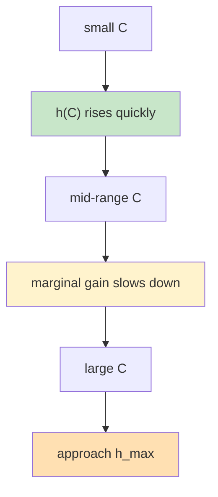

# KVCache 通用分析框架：四层模型

> **“先回答给多少缓存能命中多少，再回答这些命中能换来多少吞吐；机器数只是最后一层后处理。”**
> 这份文档面向对外展示，定义一个尽量简洁、可计算、可扩展的 KVCache 分析框架。项目对外固定讲四层：`工作集结构 -> 容量命中 -> 命中吞吐 -> 吞吐机器数`。

---

## 1. 核心问题

一个通用的 KVCache 分析框架，对外最需要回答四层问题：

1. **工作集结构是什么？** 是否存在共享前缀、私有上下文、明显的复用天花板？
2. **给定缓存容量 `C`，命中率 `h(C)` 大概是多少？**
3. **给定命中率 `h`，吞吐 `TPS(h)` 能提升多少？**
4. **如果总需求固定，机器需求会如何变化？**

其中第 4 个问题不是主模型，而是第 3 个问题的后处理。


对外主线到这里就够了：

- 先描述 workload 结构
- 先估命中
- 再算吞吐
- 最后如有需要，再换算机器数

---

## 2. 主模型

### 2.1 容量-命中率模型

主模型的第一步是定义：

```text
h = h(C)
```

其中：

- `C`：有效 KVCache 容量，可以用 `tokens`、`blocks` 或 `bytes` 表示
- `h(C)`：容量为 `C` 时的命中率

### 两种输入方式

#### 方式 A：有 profile / trace

如果已经有 workload trace 或 replay profile，那么 `h(C)` 可以直接由分析器计算得到。

这时框架并不要求对外暴露具体求解器细节；无论底层使用：

- 上界分析
- 策略模拟
- replay 统计
- trace 拟合

最终对外输出都统一成同一个对象：

```text
capacity -> hit curve
```

#### 方式 B：没有 profile

如果没有 trace，需要一个简单、稳定、可解释的近似函数。推荐使用饱和型曲线：

```text
h(C) = h_max * (1 - exp(-(C / C50)^p))
```

其中：

- `h_max`：可达到的最大命中率
- `C50`：达到一半效果所需的容量尺度
- `p`：曲线陡峭程度

这条曲线的好处是：

- 天然满足边际收益递减
- 直观表达“越接近极限，继续加缓存越不值”
- 易于用少量观测点拟合
- 不绑定某种特定缓存策略

### 直观形状



### 这个模型回答什么

它回答：

- 多大的缓存能达到目标命中率
- 继续增加缓存是否还有显著收益
- 不同 workload 的容量敏感性差异

它不直接回答：

- 某个具体缓存策略是否已经达到这个曲线
- 吞吐会增加多少
- 机器数会减少多少

这些属于后两层映射。

---

### 2.2 命中率-TPS 模型

第二步是把命中率映射为吞吐提升。对外最简洁、最稳定的一阶模型是：

```text
TPS(C) = TPS0 / (1 - alpha * h(C))
```

其中：

- `TPS0`：零命中时的基线吞吐
- `h(C)`：容量 `C` 下的命中率
- `alpha`：命中后可节省的 prefill 计算比例

也可以写成吞吐放大因子：

```text
gamma(h) = 1 / (1 - alpha * h)
```

以及：

```text
TPS(C) = TPS0 * gamma(h(C))
```

### 为什么这个形式足够好

这个模型的核心优点是：

- 机器数已经被剥离出去
- 主线只关注单机或单 GPU 的归一化吞吐
- 非常容易解释给外部用户
- 容易和真实测量值做校准

### 直观含义

- 当 `h(C)` 增大时，被跳过的 prefill 计算更多
- 当 `alpha` 较大时，命中对吞吐更敏感
- 当 `alpha * h(C)` 接近 1 时，说明缓存复用对吞吐影响极强

### 使用边界

这个模型适合作为公开版的一阶近似，但必须明确它的适用范围：

- 主要瓶颈来自 prefill
- decode 开销不随命中率同步线性下降
- 目标是估算吞吐收益，而不是精确模拟调度细节

它不直接建模：

- 调度队列变化
- 批处理形状变化
- 远端 KV 搬运带宽
- 反馈引起的访问模式变化

如果这些问题必须精确处理，应由更细的内部分析引擎单独承担，而不应污染公开主公式。

---

### 2.3 TPS-机器数关系

机器数不应进入主模型，而应作为后处理单独计算。

如果系统总需求为 `Q`，而 `TPS(C)` 是单机吞吐，则：

```text
Machines(C) = Q / TPS(C)
```

这一步的意义是：

- 主模型只讨论 `C -> h -> TPS`
- 机器数只是把吞吐结果投影到部署规模上

因此推荐的展示顺序始终是：

```text
Capacity -> Hit Rate -> TPS -> Machines
```

而不是：

```text
Machines -> Capacity -> Hit Rate -> TPS
```

后者容易把部署规模、资源供给和工作负载本身混在一起。

---

## 3. 无 Profile 估计

如果没有完整 trace，框架仍然需要给出一个可用起点。当前推荐两级做法：

### 3.1 一级：最简单的饱和曲线

如果只想先拟合一个稳定曲线，可以使用：

```text
h(C) = h_max * (1 - exp(-(C / C50)^p))
```

它的优点是：

- 参数少
- 边际收益递减天然成立
- 适合少量观测点拟合

### 3.2 二级：多 Agent 并发 heuristic

如果希望比单条曲线多一点结构信息，但仍然不依赖 trace，可以使用：

```text
shared prefix + private working set + curve shape
```

先定义：

```text
P = (1 / T) * sum_{i=0}^{T-1} min(W, i * Delta)
W_total = S + n * P
L_request = S + Delta + P
h_content = (S + P) / L_request
```

其中：

- `n`：并发 Agent 数
- `S`：共享前缀 token
- `Delta`：每轮新增 token
- `T`：平均会话轮数
- `W`：单 Agent 私有窗口

然后把容量先映射成私有工作集覆盖比例：

```text
r = clip((C - S) / (n * P), 0, 1)
```

再用形状函数 `g(r)` 估计私有部分覆盖效果：

```text
h_strict_est(C) = min(h_content, (S + g(r) * P) / L_request)
```

### 3.3 三种曲线形状

| 模式 | 公式 | 解释 |
|------|------|------|
| `linear` | `g(r) = r` | 最简单的线性覆盖 |
| `power_law_fit` | `g(r) = r^(1 - 1/s)` | 直接吸收 Zipf-inspired 简化公式 |
| `zipf_harmonic` | `g(r) = H_{floor(rN), s} / H_{N, s}` | 用离散 Zipf 累积质量做更稳的形状近似 |

这里的 `power_law_fit` 对应常见的：

```text
h(C) ~= (C / W_total)^(1 - 1/s)
```

这个公式有用，但它是经验近似，不是严格证明。

### 3.4 策略近似

没有 trace 时，不能精确 replay 在线 LRU，所以框架只提供 `LRU-like` 近似：

```text
r_lru = clip(eta * (C - S) / (n * P), 0, 1)
```

其中 `eta in (0, 1]` 表示在线策略的有效容量折损系数。

于是：

```text
h_lru_like_est(C) = min(h_content, (S + g(r_lru) * P) / L_request)
```

### 3.5 公开口径

对外必须把这条路径明确叫做 `heuristic`，不能把它说成：

- strict-prefix oracle
- 真实 LRU 模拟
- 已被证明的命中率

它的正确定位是：

- 冷启动估计
- 容量规划初筛
- profile 到来前的第一版资源预算

---

## 4. 参数说明

| 符号 | 含义 | 备注 |
|------|------|------|
| `C` | 有效缓存容量 | 可用 `tokens / blocks / bytes` 表示 |
| `h(C)` | 容量 `C` 下的命中率 | 主分析对象 |
| `h_max` | 最大可达命中率 | workload 天花板 |
| `C50` | 半饱和容量 | 容量尺度参数 |
| `p` | 曲线陡峭度 | 形状参数 |
| `n` | 并发 Agent 数 | 结构层输入 |
| `S` | 共享前缀 token | 所有 Agent 共用 |
| `Delta` | 每轮新增 token | 单次对话增量 |
| `T` | 平均会话轮数 | 会话深度 |
| `W` | 私有窗口 | 单 Agent 上下文上限 |
| `P` | 单 Agent 平均可复用私有 token | `append-only` 平均结果 |
| `s` | Zipf 形状参数 | 仅用于 `power_law_fit / zipf_harmonic` |
| `eta` | 在线策略效率系数 | 用来近似 `LRU-like` 损失 |
| `TPS0` | 基线吞吐 | 零命中时的单机吞吐 |
| `alpha` | prefill 节省比例 | 命中后可转化为吞吐收益的比例 |
| `TPS(C)` | 容量 `C` 下的吞吐 | `TPS0 / (1 - alpha * h(C))` |
| `Q` | 总需求吞吐 | 用于后处理机器数 |
| `Machines(C)` | 所需机器数 | `Q / TPS(C)` |

---

## 5. 推荐输出格式

一个公开框架最适合输出下面这组对象：

### 5.1 主曲线

- `capacity -> hit`
- `capacity -> TPS`
- `capacity -> machines`（可选）

### 5.2 关键点

- 达到目标命中率所需容量
- 达到目标 TPS 增益所需容量
- 边际收益开始变缓的容量区间
- 接近饱和的容量区间

### 5.3 推荐表头

| Capacity | Hit Rate | TPS Gain | TPS | Machines Needed |
|----------|----------|----------|-----|-----------------|
| `C1` | `h(C1)` | `gamma(h(C1))` | `TPS(C1)` | `Q / TPS(C1)` |

这种输出形式的好处是：

- 主线非常稳定
- 既能做规划，也能做对比
- 既适合有 profile，也适合无 profile 场景

---

## 6. 工程实现建议

对外主文档不需要展开所有内部求解细节，但工程上建议把分析器分成四类引擎：

| 引擎 | 作用 |
|------|------|
| **Structure Engine** | 描述共享前缀、私有工作集、并发度等结构参数 |
| **Hit Engine** | 生成 `h(C)`，支持 trace/profile 或参数化估计 |
| **TPS Engine** | 把 `h(C)` 映射成 `TPS(C)` |
| **Sizing Engine** | 把 `TPS(C)` 投影到机器需求或资源节省 |

无论底层是否采用更细的分层实现，对外 API 都建议固定为：

```text
Capacity -> Hit -> TPS -> Machines
```

这样最容易保持框架的通用性与可解释性。

---

## 7. 总结

| 结论 | 说明 |
|------|------|
| 对外主线应尽量短 | 固定成 `工作集 -> 容量 -> 命中 -> TPS -> 机器数` |
| 机器数不应进入主公式 | 它只是吞吐结果的后处理 |
| 无 profile 估计应先讲清工作集结构 | 先共享/私有，再选曲线形状 |
| 复杂求解细节应隐藏在内部引擎中 | 不污染公开框架表达 |

这个通用分析框架最重要的价值在于：

> **把 KVCache 问题压缩成一个简单、稳定、可计算的四层主链条：先描述工作集，再估命中，再算吞吐，最后再做容量与机器规模决策。**
